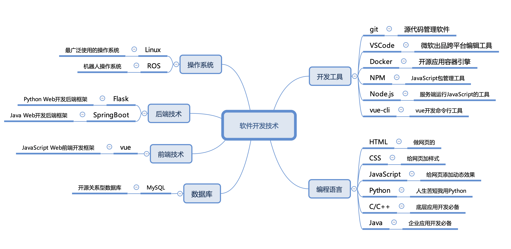

# 文档说明
本文档包含开发前后端分离的Web和移动应用，以及ROS（机器人操作系统）应用所需要的技术方法。本文档将为每一项技术梳理一个学习的路线图，给出相关的学习资料。你需要按照文档中给出的学习路线图，进一步阅读资料。文档所涉及的技术如下：



文档和代码包含在[doc](doc)目录下，请按照如下顺序阅读文档：
  - [git](#git)
  - [VSCode](#vscode)
  - [Docker](#docker)
  - [Linux](#linux)
  - [C/C++](#cc)
  - [Python](#python)
  - [Java](#java)
  - [HTML](#html)
  - [CSS](#css)
  - [JavaScript](#javascript)
  - [Node.js](#nodejs)
  - [NPM](#npm)
  - [webpack](#webpack)
  - [vue-cli](#vue-cli)
  - [vue](#vue)
  - [Flask](#flask)
  - [Ros](#ros)
  - [springboot](#springboot)
  
由于上述每项技术均非常复杂，本文档不可能包含这些技术的全部内容，因此本文档的目标是为每一项技术梳理一个学习的路线图，给出相关的学习资料。你需要按照文档中给出的学习路线图，进一步阅读资料。
## git
git是使用最为广泛的源代码管理工具。考虑到已经有非常多的文档介绍git，本课程将不再介绍git，你可以通过阅读如下文档学习git：
1. [git - 简易指南](https://www.bootcss.com/p/git-guide/)，入门足够了。
2. [git菜鸟教程](https://www.runoob.com/git/git-tutorial.html)，菜鸟从入门到精通 
3. [廖雪峰的git教程](https://www.liaoxuefeng.com/wiki/896043488029600/896067008724000) ，廖雪峰的付费课程就不必了（人傻钱多？）。
4. [B站上的git教学视频](https://www.bilibili.com/video/BV1pW411A7a5?from=search&seid=6569238819238894538)，随便找了一个，B站上还有很多。

本文档放在github上，因此你还需要了解和使用[github](https://github.com)。实践是最好的老师，git就像微信支付。随着课程的深入，git的使用会越来越多，老师根本不担心你们掌握不了（也没必要专门上个培训班，谁上过吃饭培训班？）。
## VSCode
[VSCode](https://code.visualstudio.com)是微软开发的跨平台的编辑器，可以通过插件扩展为多种技术的开发平台。VSCode很还用，跨平台，还免费，插件多（微软近年来最好的软件产品）。网上有很多VSCode的文章，请大家自行搜索。下面给出一些B站上的视频供参考：

1. [30分钟搞定 vscode 和 python 开发环境搭建](https://www.bilibili.com/video/BV1H7411U7LF?from=search&seid=4099613540422587591)
2. [十五分钟快速 win vscode C++ 环境搭建](https://www.bilibili.com/video/BV1EJ411V7uN?from=search&seid=524810549462501130)

本文档全部用VSCode编写。

## Docker
Docker 是一个开源的应用容器引擎，课程中不仅用它来进行容器化部署，还用它来构建虚拟环境。在虚拟环境中安装各种开发软件，可以避免安装的软件与物理机上的软件出现冲突（这是新手最常碰到的问题）。使用还可以解决“这个软件在我的机器上工作得很好，为啥在你的机器上用不了”这类问题。Docker是后续课程的基础，后面的课程会频繁使用，不用担心掌握不了（只要用就会懂）。

[阅读更多](doc/docker/docker.md)
## Linux
linux类的操作系统是世界上用得最多的操作系统，你应该熟练掌握。在物理机上（通常你用的是windows，少数同学会使用Mac OS）安装linux比较麻烦（不是随便一个人能搞定），而且一旦切换操作系统，就不能用你喜爱的windows（或者Mac），所以我们使用Docker来安装linux。

[阅读更多](doc/linux/linux.md)
## C/C++
Linux上的C/C++最符合C/C++规范（C99和C++14）,所以我们会使用Linux下的C/C++。为了简化按照过程，我们会使用Docker安装Linux，然后在Docker中的Linux下安装C/C++。整个过程不需要你懂什么高级操作，你只需要会使用Docker和Linux（你马上可以体会到Docker的好处）。

[阅读更多](doc/c++/c++.md)
## Python
我相信你一定知道Python，甚至有一定Python基础。因此对于Python就不讲废话了，如果没有学过可以参考如下教程（注意一定要看Python3的教程）：

1. [廖雪峰的Python3教程](https://www.liaoxuefeng.com/wiki/1016959663602400)
2. [零基础入门学习Python](https://www.bilibili.com/video/BV1xs411Q799?from=search&seid=2632798074318327637)

## Java
专业程序员会使用Java。如果你不准备成为专业程序员，这部分可以跳过。视频教程可以参考：

1. [Java零基础教程视频](https://www.bilibili.com/video/BV1Rx411876f?from=search&seid=5831169845635309440)
## HTML
HTML就是超文本标记语言，也就是常说的网页。HTML的学习可以参考如下教程：

1. [HTML菜鸟教程](https://www.runoob.com/html/html-tutorial.html)
2. [为初学者准备的：HTML速成](https://www.bilibili.com/video/BV1vs411M7aT?from=search&seid=4972705135983111226)

## CSS
如何为HTML加上样式呢？那就需要使用CSS。CSS的学习可以参考如下教程：

1. [菜鸟CSS教程](https://www.runoob.com/css/css-tutorial.html)
2. [黑马程序员pink老师前端入门视频教程 HTML5+CSS3+移动端布局](https://www.bilibili.com/video/BV14J4114768?from=search&seid=3887220373124555937)


## JavaScript
JavaScript是Web前端开发的编程语言，现在几乎所有的网页都使用JavaScript。JavaScript语言非常简单，网上教材很多，几个小时左右可以学完。参考教程如下：

1. [JavaScript菜鸟教程](https://www.runoob.com/js/js-tutorial.html)
2. [B站尚硅谷最新版JavaScript基础全套教程完整版](https://www.bilibili.com/video/BV1YW411T7GX?from=search&seid=14291089148265450182)


## Node.js
Node.js是一种运行在服务器端的[JavaScript](https://www.runoob.com/js/js-tutorial.html)。JavaScript是一种运行在浏览器中的语言，但有了Node.js，我们就可以在服务器（或者PC机上）用JavaScript编程。简言之，Node.js将JavaScript变成了另个一Python。同样，我们会使用Docker来安装Node.js，你不用担心Windows装不上Node.js。

[阅读更多](doc/nodejs/nodejs.md)
## NPM
NPM是随同Node.js一起安装的包管理工具。什么是包管理工具？就是类似app store一样的玩意。智能手机要装软件用app store。JavaScript开发要装第三方包，用NPM。史前时代的程序员，为了装一个jquery，需要先上百度搜索，然后花十多分钟找到一个可用的下载链接，用工具下载，解压，拷贝到某某目录，然后......这个过程想想都让人头痛。而使用NPM，只需要执行指令：
```plain
npm install jquery
```
[阅读更多](doc/npm/npm.md)
## webpack
webpack是一个JavaScript程序的打包器。使用npm和Vue开发网页前端会默认使用到webpack，了解webpack的基本概念，对于优化Vue页面很有价值。当然不理解webpack也可以过得很好（Vue-cli会处理大多数默认情况）。

[阅读更多](doc/webpack/webpack.md)
## vue-cli
vue-cli是vue开发的命令行工具（Command Line Interface）。程序总是喜欢CLI而不是可视化界面，因为可视化会显著降低工作效率。利用CLI可以在一秒钟的时间内，完成可视化界面几分钟到几十分钟（或者更长）才能完成的工作。使用CLI还是可视化界面是程序员和普通用户（当然也包含部分新手程序员）的主要区别。

[阅读更多](doc/vue-cli/vue-cli.md)
## vue
vue是一款JavaScript前端框架。Web前端开发，过去一直是[HTML语言](https://www.runoob.com/html/html-tutorial.html)的天下。而使用JavaScript是现在的主流方法。我们会重点讲解Vue，在学习Vue之前，你应该已经掌握或者了解了：
- Docker
- Linux
- Node.js（含JavaScript）
- NPM
- webpack
- vue-cli
- HTML语言

[阅读更多](doc/vue/vue.md)
## Flask
Flask是轻量级的Python web框架，与另一款常用的框架[Django](https://www.runoob.com/django/django-tutorial.html)相比，Flask更容易掌握。

[阅读更多](doc/flask/flask.md)
## Ros
Ros是机器人操作系统，我们使用Docker来安装Ros，在学习Ros之前，你需要掌握和了解如下的知识：
- Docker
- Linux
- C/C++
- Python

[阅读更多](doc/ros/ros.md)
## SpringBoot
springboot是一款Java轻量级企业应用开发框架。如果学到这一步，你就专业程序员。视频资料请参考：

1. [SpringBoot 权威教程](https://www.bilibili.com/video/BV1Et411Y7tQ?from=search&seid=1052053272973511669)
2. [SpringBoot最新教程IDEA](https://www.bilibili.com/video/BV1PE411i7CV?from=search&seid=1052053272973511669)
[阅读更多](doc/springboot/springboot.md)

## MySQL
MySQL是一款开源关系型数据库。相关学习资料可以参考：

1. [菜鸟MySQL教程](https://www.runoob.com/mysql/mysql-tutorial.html)
2. [MySQL_基础+高级篇](https://www.bilibili.com/video/BV12b411K7Zu?from=search&seid=8327720761313263084)