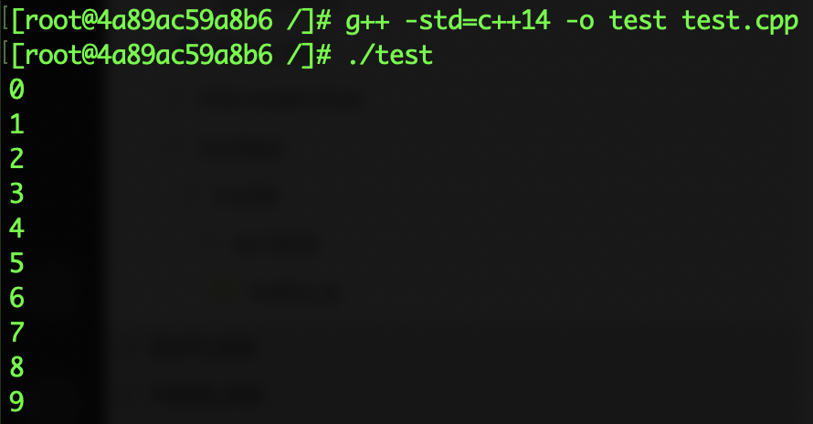

[C/C++的语言标准](#C/C++的语言标准)

[使用支持新语言特性的编译器](#使用支持新语言特性的编译器)

# C/C++的语言标准


C/C++的学习资料浩如烟海，但是只有极少数涉及最新的C/C++标准。国内某些大学的C/C++课程甚至还停留在使用VC++6.0的时代（1998年发布）。C/C++一直在发展，现在的语言标准已经和几十年前有非常大的差异。C语言的语言标准发展历史如下：

| 标准名称 | 发布年份                |
| -------- | ----------------------- |
| C89      | 1989年                  |
| C90      | 1990年（实际上就是C89） |
| C99      | 1999年                  |
| C11      | 2011年                  |

国内教学最常使用的标准是C90，但教学使用的编译器大多数支持C99标准（GCC、Viusual Studio C++ 20XX版本）。C11标准在最新的编译器中应该都是支持的。由于C语言不是一门跨平台的语言，因此了解编译器对语言规范的支持，以及不同语言规范的差异是非常必要的。单片机系统大多只支持C90（C89）规范，甚至部分系统只支持C语言规范的子集。要了解C语言各语言规范的差异，可以参考：

1. [C99语法规则](https://blog.csdn.net/qq_31360933/article/details/79328675)
2. [C11 标准新特性](https://blog.csdn.net/u012611878/article/details/79090793)

C++语言的发展历史比C语言复杂得多。我认为（估计也是很多人的共识）C++是最复杂的一门编程语言，它支持面向过程编程、面向对象编程、泛型编程、函数式编程、模板元编程等编程方法。C++兼容C语言，不能跨平台，语言规范版本众多。并且随着技术的发展，越来越多的特性被添加到C++中，导致这个语言非常臃肿。对于计算机类专业的学生，学习C++是非常必要的。它很复杂，意味着它几乎会涉及到计算机底层一切相关的技术。但就编写软件而言，除了游戏、某些特别需要性能优化的应用和系统底层的开发，其他场景，C++很难有用武之地。C++语言标准的发展历史如下：

| 标准名称    | 发布年份 |
| ----------- | -------- |
| C++98       | 1998年   |
| C++03       | 2003年   |
| C++11,C++0x | 2011年   |
| C14,C++1y   | 2014年   |
| C++17,C++1z | 2017年   |
| C++20,C++2a | 2020年   |

要了解C++11之后的语言规范，可以参考：

1. [C++11特性-概览](https://www.jianshu.com/p/5480c4a35d1d)
2. [C++11 & C++14 & C++17新特性](https://www.cnblogs.com/guxuanqing/p/6707824.html)
3. [10分钟速览 C++20 新增特性](https://zhuanlan.zhihu.com/p/137646370)


# 使用支持新语言特性的编译器

建议大家使用GCC来体会C/C++的新语言特性。同样使用docker来安装最新版本的GCC，Dockerfile如下：

```dockerfile
FROM centos
RUN yum -y install gcc-c++.x86_64
```

截止写作为止，默认安装的是GCC 8.0，已经部分支持C++20的特性。我将镜像推送到了`liujiboy/gcc8`，各位可以直接使用这个镜像。

首先进入镜像，执行如下代码：

```shell
docker run -i -t liujiboy/gcc8 /bin/bash
```

然后在命令行下，利用`vi`或者`emacs`等文本编辑工具编辑如下代码（[test.cpp](code/test.cpp)）：

```cpp
#include<iostream>
#include<vector>
using namespace std;
int main(){
    vector<int> v;
    for(int i=0;i<10;i++)
        v.push_back(i);
    auto print=[](auto x) {cout<<x<<endl;};
    for(auto i:v)
        print(i);
}
```

该代码需要`c++14`规范的支持。运行`gcc`:

```shell
g++ -std=c++14 -o test test.cpp
```

`-std=`参数指定编译器的语言规范是`c++14`。编译之后，当前目录下出现一个`test`文件，执行：

```shell
./test
```

就可以看到如下结果：



你也可以把本地目录挂载到docker虚拟机上，然后用vscode来编写C++程序。

