- [Docker有啥用](#docker有啥用)
- [Docker的安装](#docker的安装)
- [设置国内镜像](#设置国内镜像)
- [测试Docker](#测试docker)
  - [运行hello-world](#运行hello-world)
  - [运行python](#运行python)
  - [使用CentOS](#使用centos)
    - [安装CentOS](#安装centos)
    - [后台运行CentOS](#后台运行centos)
    - [attach运行着的镜像](#attach运行着的镜像)
    - [重启或者终止](#重启或者终止)
  - [制作自己的Docker镜像](#制作自己的docker镜像)
  - [使用进阶](#使用进阶)
    - [挂载物理机目录](#挂载物理机目录)
    - [端口映射](#端口映射)
  - [如果你需要AI](#如果你需要ai)
  - [你需要自己定制镜像吗？](#你需要自己定制镜像吗)
- [总结](#总结)
# Docker有啥用
Docker是一款开源应用容器引擎，我们可以认为Docker是运行于物理主机之上的虚拟机，在这个虚拟机上，可以运行各种各样的程序（甚至操作系统）。为什么要在虚拟机上运行程序，程序不是直接可以装在物理机上（比如windows系统）中吗？下面我们来看几个典型应用场景：

1. 你需要学习Linux操作系统，但你只有一台Windows电脑。
2. 你需要学习ROS（机器人操作系统），但你只有一台Windows电脑。
3. 你需要学习vue开发，为此你需要安装Node.js、NPM、vue-cli等一系列工具，但你只有一台Windows电脑。
4. 你在Windows电脑上开发了一个网站，该网站需要Python、Nginx服务器、MySQL数据库等运行环境，你希望在同学的电脑上部署该网站，但你的同学是一个果粉，他只有Mac电脑。
5. 你是一个新手程序员，你想学习Python、C++、Java，但你不会安装开发环境。

以上的问题均可以使用Docker轻松解决。我们可以将Linux、ROS、Python、C++、Java等打包为Docker镜像（Docker Image），然后将镜像在Docker虚拟机上运行（如下图所示）。用户在使用时，尽管使用的是Docker虚拟机中的程序，但用户无法分辨程序是运行在物理机上还是虚拟机上。由于Docker是跨平台的，因此只要物理机可以安装Docker，那么就能运行任何Docker镜像。

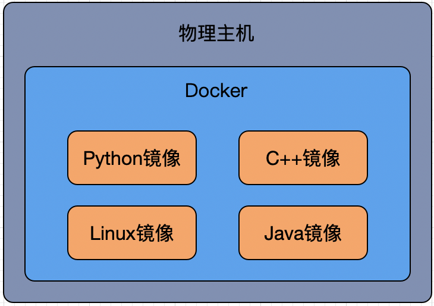

简言之，对于场景1-5，只要有对应的Docker镜像，就能立刻运行镜像，然后开始使用软件。这就为跨平台部署、软件配置等工作提供了极大的便利。对于新手程序员的，如果不想把时间浪费在环境的安装、配置上，使用Docker也可以极大简化学习过程。同时，新手程序员也可以在Docker上学习各种软件的安装和配置，而不用担心搞坏物理主机（因为虚拟机是运行在物理机上的沙箱SandBox，你可以随便折腾，搞坏了重新建一个就行）。

说一千道一万，不如实际用一遍。下面我们就来学习一下Docker的使用。本文档不如[菜鸟Docker教程](https://www.runoob.com/docker/docker-tutorial.html)全面，建议你在阅读本文档之后，进一步阅读[菜鸟Docker教程](https://www.runoob.com/docker/docker-tutorial.html)。或者在遇到问题是，阅读[菜鸟Docker教程](https://www.runoob.com/docker/docker-tutorial.html)。

# Docker的安装
在使用Docker之前，你需要学会安装Docker。各种操作系统安装Docker的教程可以参考：
1. [Windows](https://www.runoob.com/docker/windows-docker-install.html)
2. [Mac](https://www.runoob.com/docker/macos-docker-install.html)
3. [CentOS](https://www.runoob.com/docker/centos-docker-install.html)
4. [官方文档](https://www.docker.com)，菜鸟教程可能较官方已经过时，因此如果遇到安装问题，建议直接按照官方文档安装

Windows和Mac的安装都非常傻瓜化，下载安装包，一通Next即可。

# 设置国内镜像
Docker镜像的一个重要来源是[DockerHub](https://registry.hub.docker.com)，这个网站在国内访问起来很慢，因此需要设置国内的加速。设置方法参考如下教程：
1. [Docker镜像加速](https://www.runoob.com/docker/docker-mirror-acceleration.html)

如果你对网速有信心，或者你搞不懂镜像的设置，可以跳过这一步。使用时除了慢点，也没啥大毛病。

# 测试Docker
安装好Docker，也设置好镜像，下面就可以测试一下Docker的使用。我们来做两个例子。
## 运行hello-world
切换到命令行下（对windows命令行操作不熟悉的同学，可以看[这里](https://www.jianshu.com/p/4262b8603e9e)），执行如下指令：

```plain
docker run hello-world
```
如果执行成功，你将看到如下输出(可能会略有区别)：

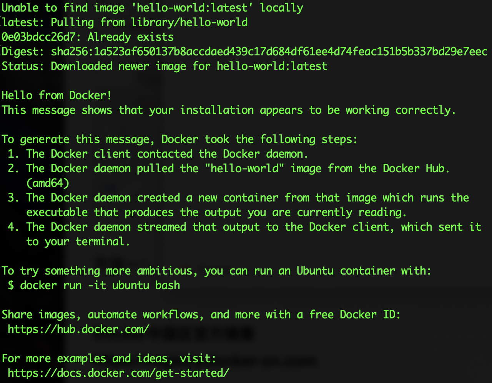

执行如下指令：
```plain
docker images
```
你可以看到一个名称为`hello-world`的镜像已经从DockerHub上拉取下来了，docker run执行了这个镜像。

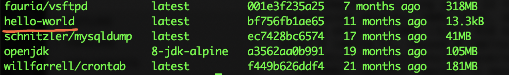

## 运行python
下面我们用Docker来使用python，先利用searc指令查找DockerHub上的python镜像
```plain
docker search python
```
显示如下结果（可能会有差异）：

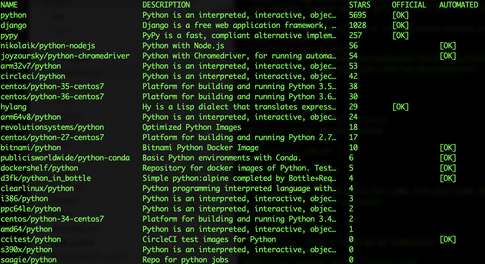

我们安装并运行第一个

```plain
docker pull python
```
该指令只从网上拉取python但不运行（拉取过程如下图）

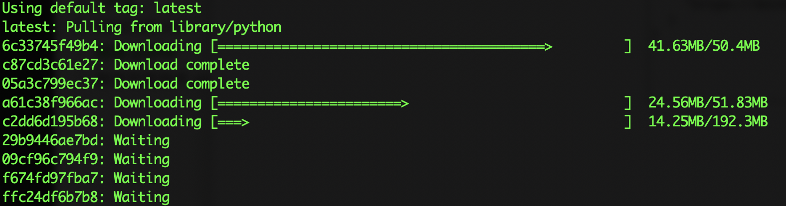
要想运行还需要执行

```plain
docker run python
```

`居然啥也没有！！`其实正确的指令是：
```plain
docker run -i -t python
```
`-i`表示以`interactive`方式运行，`-t`表示为用户分配一个`tty`(百度一下tty是啥意思)，于是就能开启交互式的python窗口，如下图：

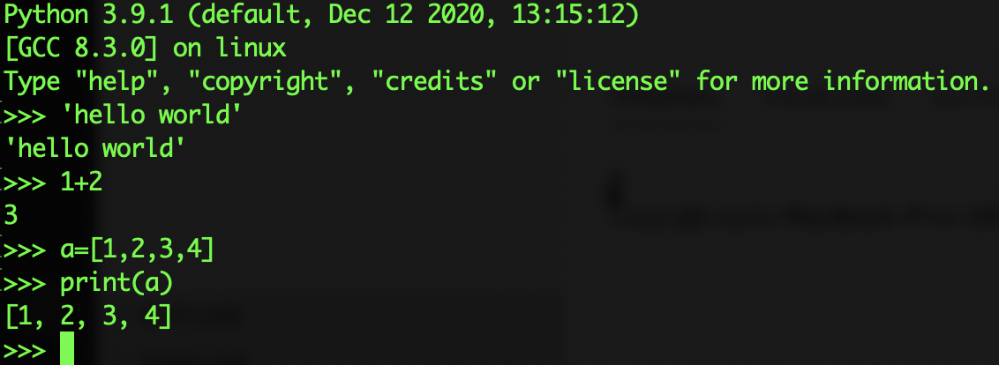

`没有安装任何Python软件，但我们先做可以用Python编程了！`在刚才那条指令中，`python`是DockerHub上的Docker镜像的名字。`docker pull`拉取了`python镜像`，`docker run`执行了`python镜像`。现在我们应该记住两个常用的docker指令：
1. docker pull [镜像名称]，从DockerHub上拉取一个镜像。
2. docker run [镜像名称]，运行镜像，如果镜像不存在，则从DockerHub上拉取。

## 使用CentOS
### 安装CentOS
[CentOS](https://www.centos.org)是一款Linux操作系统。Linux操作系统在服务器端、移动设备和嵌入式设备中广泛使用，是目前使用最为广泛的操作系统（Android手机均运行Linux）。要在个人电脑上安装CentOS是非常复杂的，例如B站上的视频，也是用VMware这款虚拟机来安装（视频见[这里](https://www.bilibili.com/video/BV1fs411b77N?from=search&seid=6500461877887601692)）。现在我们用Docker来安装、使用CentOS。首先搜索一下：
```
docker search centos
```
有很多CentOS镜像

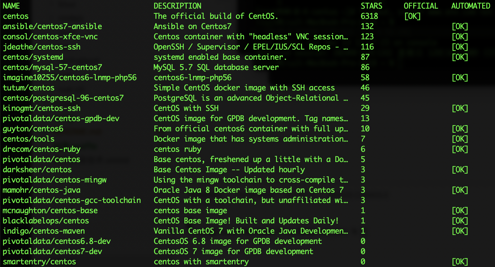

我们使用第一个
```
docker pull centos
```
下载完成后，使用`docker images`指令，可以看到下载后的centos镜像，如下：

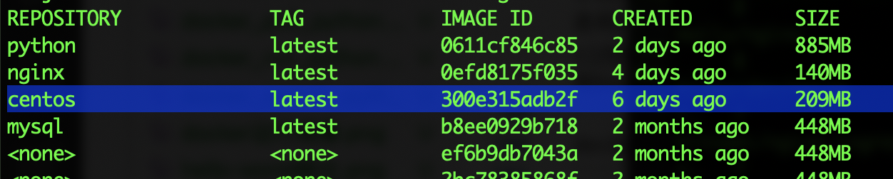

用`docker run`启动镜像

```
docker run -i -t centos
```
然后就可以进入centos系统，并执行指令，如下：

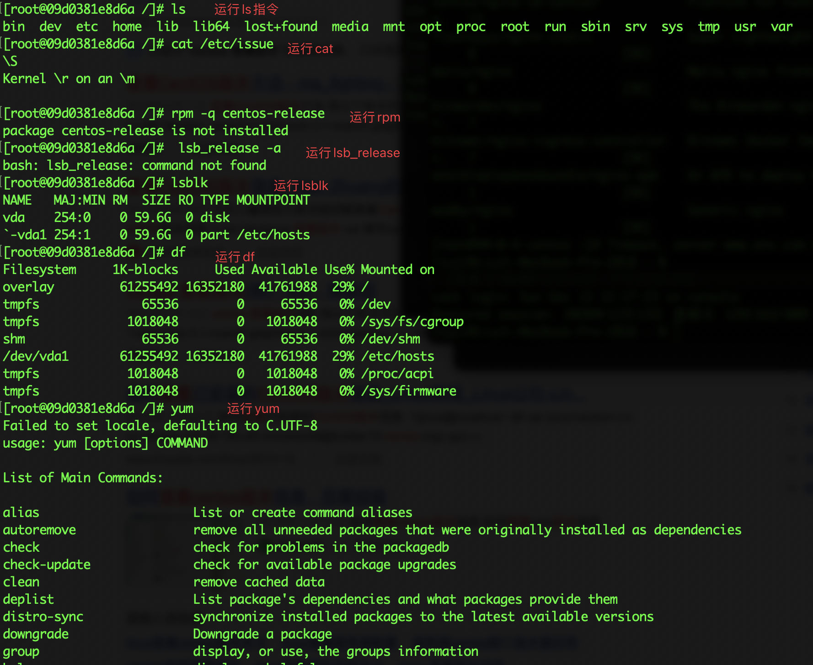

现在你还不理解centos能做什么，目前你只需要知道centos是和Windows一样强大的操作系统（应该是更强大）。

在centos中执行`exit`就可以退出，退出之后centos就终止了。

### 后台运行CentOS
如果我们希望centos一直运行呢？下面我们来看看如何让centos在后台运行。

执行如下指令:
```
docker run -d -i -t --name centosA centos
docker run -d -i -t --name centosB centos
```
每次执行都会出现了一串奇怪的数字。请注意`-d`这个参数，它的含义是让运行的虚拟机在后台运行。简言之，执行`exit`会退出centos，但centos操作系统不会终止运行。我们执行如下指令就可以看到运行中的centos:
```
docker container ls
```
或者
```
docker ps
```
可以看到运行着的docker镜像

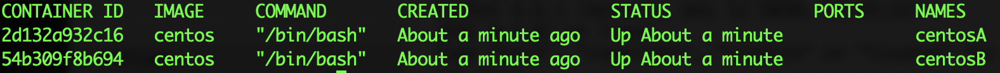

`--name`的作用则是为运行的镜像加上名字，方便后续的操作。

### attach运行着的镜像
现在执行操作`docker attach centosA`就可以进入名称为`centosA的docker镜像`。如果执行`docker attach centosB`就可以进入名称为`centosB的docker镜像`。

试试如下操作：
1. docker attach centosA
2. touch centosA.txt
3. ls /
4. exit

接着
1. docker attach centosA
2. touch centosB.txt
3. ls /
4. exit

效果如下：

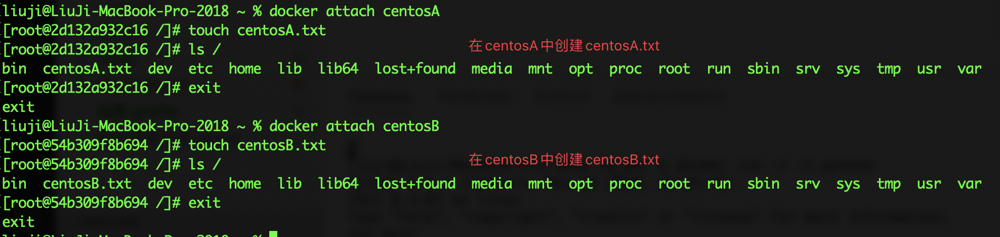

### 重启或者终止
**注意：** 在执行上述操作时如果遇到centos已经终止，可以执行`restart`重新启动镜像：
```
docker restart centosA
docker restart centosB
```
如果想要终止镜像的执行则可以使用`kill`指令：
```
docker kill centosA
docker kill centosB
```

## 制作自己的Docker镜像
Docker最强大的功能在于用户可以定制自己的镜像。考虑下面的应用场景：

    刘老师每年给大一新生上Python程序设计课程，需要CentOS系统的计算机，并且安装Python、pip（Python的包管理工具）、numpy、scipy、matplotlib和jupyter等工具。

刘老师现在有两个选择：

1. 在实验室中找一台机器，配置好环境，然后把这台机器的环境，克隆到其他计算机。
2. 制作一个Docker镜像。

刘老师一定会选择第二种方式，因为第一种方式需要花费刘老师半天的时间，而第二种方式只需要几分钟。你没看错，`第一种方式需要半天，第二种方式只要几分钟`。下面给出做法：

1. 找一个文本编辑器，比如记事本。
2. 编写一个名称为Dockerfile的文件。

Dockerfile(见文件[doc/docker/code/centos-python1/Dockerfile](code/centos-python1/Dockerfile))中包含如下内容：
```Dockerfile
#以centos镜像为基础
FROM centos
#安装epel（好像这一步不是必须的）
RUN yum -y install epel-release
#安装python3.8
RUN yum -y install python38
#用pip3安装numpy scipy matplotlib sympy pandas jupyter
RUN pip3 install -i https://mirrors.aliyun.com/pypi/simple/ numpy scipy matplotlib sympy pandas jupyter
```

你可以直接拷贝上述代码。下面我们生成Docker镜像，在Dockerfile所在目录，执行如下指令：

```
docker build -t centos-python1:latest .
```
千万**注意**最后有一个`.`，表示Dockerfile在执行指令的当前目录。如果你在本文档的根目录，那么执行：

```
docker build -t centos-python1:latest doc/docker/code/centos-python1 
```
`-t`表示给生成的镜像加一个名字，格式是`name:tag`，`centos-python1:latest`就是镜像的名称。执行这个指令之后，你就能够看到镜像的生成过程，如下：

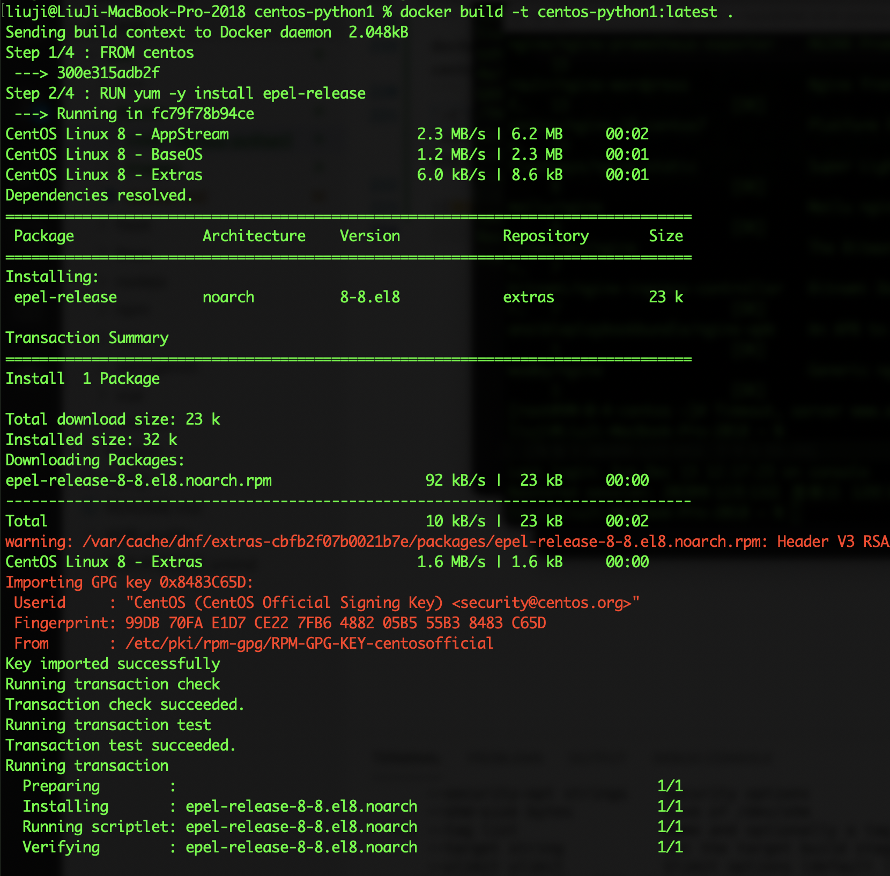

之后用`docker images`指令可以查看到生成的镜像

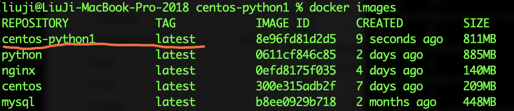

下面是激动人心的时刻，执行`docker run`启动该镜像，就可以使用python（安装了numpy scipy matplotlib sympy pandas jupyter）


**刘老师只需要把写好的Dockerfile拷贝给同学们，就可以为所有人配置好环境（前提是每个人都安装好Docker，并学会基本的使用）。** 如果对老师安装的环境不满意，调整也非常简单，只需要修改Dockerfile并重新生成镜像即可。

## 使用进阶
### 挂载物理机目录
Docker镜像运行在虚拟机中（顺便说一句，运行的镜像称为容器Container），虚拟机无法直接访问物理机的硬盘，物理机也无法直接访问虚拟机的文件。这样具有更高的安全性，不会因为虚拟机程序的崩溃导致物理机的问题。但偶尔我们也需要在虚拟机中访问物理机的文件，因此就需要用到挂载物理机目录。方法很简单，在启动容器时，加上一个参数`-v`，指令如下：

```
docker run -i -t -v [物理机目录]:[虚拟机目录] centos-python1
```
该指令将`[物理机目录]`映射到`[虚拟机目录]`，例如：

```
docker run -i -t -v /Users/liuji/Documents/教学/明月班-软件设计/sd_doc/doc/docker/code/centos-python1:/mnt centos-python1
```

就将`/Users/liuji/Documents/教学/明月班-软件设计/sd_doc/doc/docker/code/centos-python1`这个目录映射到了虚拟机的`/mnt`目录下。我们可以看看效果：

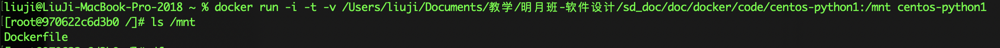

下面我们可以利用物理机的VSCode编辑一个python文件，然后在虚拟机中执行。请看截图：

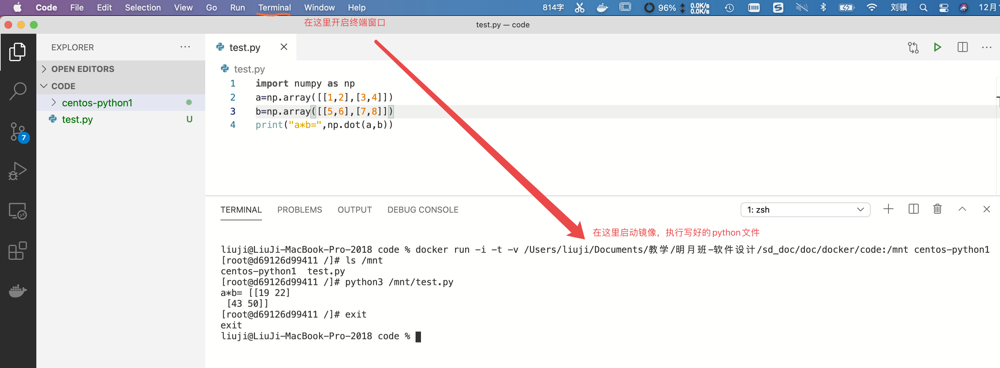

### 端口映射
jupyter notebook是基于网页的交互式Python开发工具。在刚才的镜像中，我们已经安装了jupyter。执行`jupyter notebook --allow-root`就可以启动（如下图）。

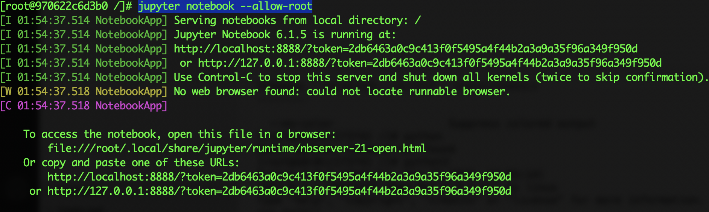

但通过物理机的浏览器无法访问到notebook。其原因在于notebook所在的8888端口，无法在物理机访问，因此我们需要把端口映射到物理机中。启动时加入`-p`参数，如下：
```
docker run -p 8888:8888 -i -t centos-python1
```

另外远程访问jupyter notebook存在一些安全限制，为了解决这些安全限制，需要做一些配置（此处约有2000字的配置）。同样，我们可以用Docker简化这个配置过程。
我们生成一个新的Dockerfile([doc/docker/code/centos-python2/Dockerfile](code/centos-python2/Dockerfile))，源代码如下：

```Dockerfile
#以centos镜像为基础
FROM centos
#拷贝.jupter目录到/root/.jupyter目录
RUN mkdir -p /root/.jupyter
COPY .jupyter /root/.jupyter
#安装epel（好像这一步不是必须的）
RUN yum -y install epel-release
#安装python3.8
RUN yum -y install python38
#用pip3安装numpy scipy matplotlib sympy pandas jupyter
RUN pip3 install -i https://mirrors.aliyun.com/pypi/simple/ numpy scipy matplotlib sympy pandas jupyter
```

生成镜像需要在目录[code/centos-python2/](code/centos-python2/)下面，因为这个目录中有一个`.jupyter`目录。在生成镜像时该目录会拷贝到镜像中（使用`COPY`指令）。具体怎么配置的？别管那么多，反正运行如下指令生成新的镜像即可。

```
 docker build -t centos-python2:latest .
```

之后运行`centos-python2`镜像

```
docker run -i -t -p 8888:8888 centos-python2
```
在虚拟机中执行`jupyter notebook --allow-root`


之后进入浏览器，访问`http://localhost:8888`，输入密码`123`，即可进入jupyter notebook。

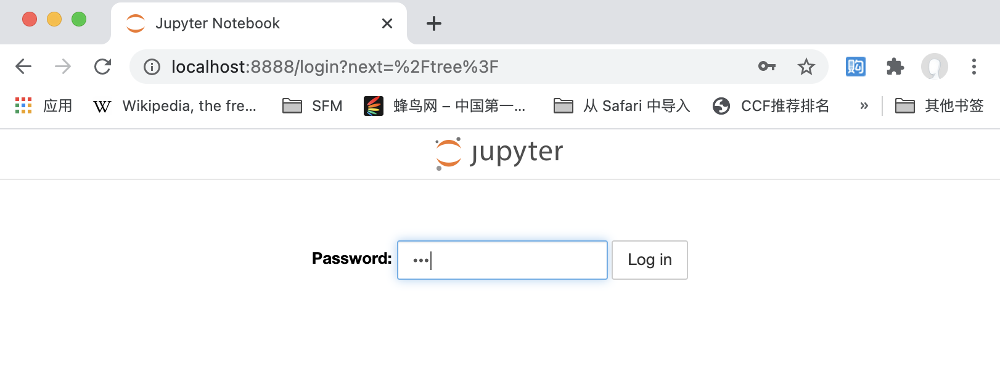

接着创建python代码

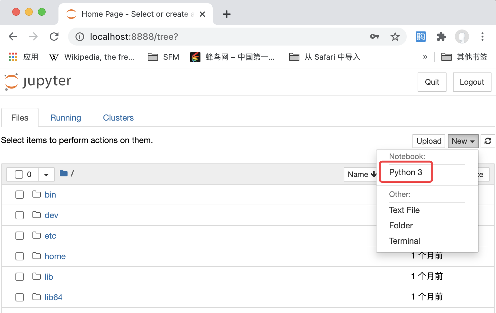

执行一个酷一点的

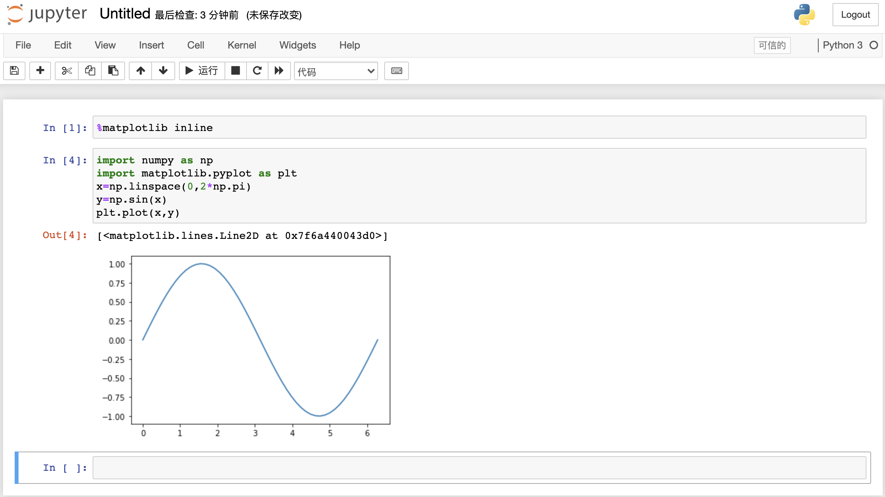

## 如果你需要AI
给你一段Dockerfile
```Dockerfile
FROM centos
#拷贝.jupter目录到/root/.jupyter目录
RUN mkdir -p /root/.jupyter
COPY .jupyter /root/.jupyter
#安装epel（好像这一步不是必须的）
RUN yum -y install epel-release
#安装python3.8
RUN yum -y install python38
#用pip3安装numpy scipy matplotlib sympy pandas jupyter
RUN pip3 install -i https://mirrors.aliyun.com/pypi/simple/ numpy scipy matplotlib sympy pandas jupyter
#安装TensorFlow
RUN pip3 install -i https://mirrors.aliyun.com/pypi/simple/ tensorflow
#安装Pytorch
RUN pip3 install -i https://mirrors.aliyun.com/pypi/simple/ torch 
RUN pip3 install -i https://mirrors.aliyun.com/pypi/simple/ torchvision
```
生成这个镜像（你并不需要理解上面的代码，虽然理解起来不难），自己试试。启动jupyter notebook，接下来就可以训练AI了。

友情提示：上述代码构建时需要的内存较大，提升docker的内存限制，以下是MacOS中的方法：


在命令行中执行，`docker stats`指令，可以查看当前运行的容积的内存占用情况。`docker run`的`-m`参数可以提高或者限制容器的内存占用。

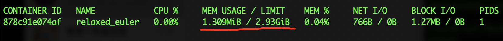

## 你需要自己定制镜像吗？
通常是不需要的，DockerHub上能找到各种镜像，课程中老师会给你提供各种镜像，百度上可以找到各种Dockerfile。有了Docker，世界真的变得很轻松。

# 总结
通过本文档你应该掌握如下的知识：

1. 如何pull docker镜像（`docker pull`）
2. 如何run docker镜像（`docker run`）
3. 如何build docker镜像（`docker build`）
4. 如何挂载目录（`-v`参数）
5. 如何映射端口（`-p`参数）

请照着这个文档做一遍，有问题参考[菜鸟Docker教程](https://www.runoob.com/docker/docker-tutorial.html)，或者上网百度。