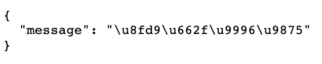

[什么是Flask](#什么是Flask)

[Flask的安装](#Flask的安装)

[Flask的使用](#Flask的使用)

# 什么是Flask

Flask是一款轻量级的Python Web开发框架。与Django相比，Flask更适合做微服务，因为Flask使用更为简单（尽管Django提供了更多的功能，但用不上）。Flask的学习教程可以参考：

1. [w3cschool的Flask教程](https://www.w3cschool.cn/flask/)
2. [Flask中文文档](https://dormousehole.readthedocs.io/en/latest/)

从做后端服务的角度来说，Flask的内容并不需要全部学，懂路由就已经解决了大半问题。

# Flask的安装

我们还是用Docker来安装Flask环境，Dockerfile如下

```dockerfile
#以centos镜像为基础
FROM centos
#安装epel（好像这一步不是必须的）
RUN yum -y install epel-release
#安装python3.8
RUN yum -y install python38
#用pip3安装numpy scipy matplotlib sympy pandas jupyter（这些可以不装，如果不需要）
RUN pip3 install -i https://mirrors.aliyun.com/pypi/simple/ numpy scipy matplotlib sympy pandas jupyter
#安装Flask Flask-Cors
RUN pip3 install -i https://mirrors.aliyun.com/pypi/simple/ Flask Flask-Cors 
```

如果需要其他python库，你可以自行修改上述文件，并构建，如下：

```shell
docker build -t liujiboy/python38-flask .
```

`liujiboy/python38-flask`是镜像的名称，我已经把这个进行推送到Docker Hub上了，你们可以直接使用这个镜像。

# Flask的使用

下面我们编写一段代码（代码在[code/app.py](code/app.py)）:

```python
from flask import Flask,request,jsonify
from flask_cors import CORS
app = Flask(__name__)
# 开启跨域资源共享
cors = CORS()
# 所有资源均可跨域
cors.init_app(app=app, resources={r"/*": {"origins": "*"}})

# 服务映射到/
@app.route("/")
def index():
    result={"message":"这是首页"}
    return jsonify(result)

# 服务映射到/hello
@app.route("/hello")
def hello():
    name=request.args["name"]
    result={"message":"hello "+name}
    return jsonify(result)
# 服务映射到/add
@app.route("/add")
def add():
    a=request.args["a"]
    b=request.args["b"]
    result={"result":a+b}
    return jsonify(result)
if __name__ == '__main__':
      app.run(host="0.0.0.0",debug=True,port=8080)
```

之后在命令行执行如下代码：

```shell
docker run -i -t -p 8080:8080 -v [本地app.py所在目录]:/mnt liujiboy/python38-flask python3 /mnt/app.py
```

指令将`app.py所在目录`挂载到虚拟机的`/mnt`目录下，然后执行虚拟机的`python3 /mnt/app.py`命令启动程序。程序启动之后，就可以在浏览器中访问。

访问http://localhost:8080/的结果如下：



访问http://localhost:8080/hello?name=liuji的结果如下：


访问http://localhost:8080/add?a=1&b=100.01的结果如下：


浏览器中显示的结果是一种称为[JSON](https://www.w3school.com.cn/json/index.asp)的数据格式，被广泛用于实现[Restful](https://www.runoob.com/w3cnote/restful-architecture.html)架构的服务。上述程序实现了3个Restful服务接口，前端程序，例如vue程序可以通过[AJAX](https://www.runoob.com/ajax/ajax-tutorial.html)调用。