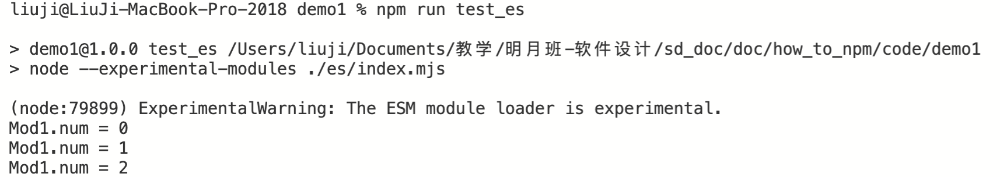

- [JavaScript模块发展的混乱史](#javascript模块发展的混乱史)
- [如何破局？](#如何破局)
- [babel和webpack](#babel和webpack)
- [示例](#示例)
  - [CommonJS](#commonjs)
  - [ECMAScript6](#ecmascript6)
  - [babel](#babel)
- [webpack打包](#webpack打包)
  - [打包./com/index.js](#打包comindexjs)
  - [打包./es/index.js`](#打包esindexjs)
  - [打包./babel/index.js`](#打包babelindexjs)
- [向NPM发布组件](#向npm发布组件)
# JavaScript模块发展的混乱史
如何用NPM制作自己的包，并发布呢？在解释这个问题之前，要稍微回顾一下JavaScript语言的发展历史。JavaScript是一个面向对象语言，但相对于其他面向对象语言，JavaScript缺乏模块机制。一直到，2015年ECMAScript6规范发布（也称ECMAScript2015）才引入了类和模块机制。

JavaScript类语法如下：

```javascript
class Animal {
    constructor(name, feature) {
        this.name = name
        this.feature = feature
    }

    toString() {
        console.log('name:' + this.name + ',feature:' + this.feature)
        // return 'Animal done'
    }
}

var animal = new Animal('monky', 'beauty')//实例化
animal.toString()
```

JavaScript模块包括export和import两部分，export如下：

```javascript
//xxx.js
export var name = 'Ryan'//导出变量
export const sort = Math.sqrt//导出常量
export {name, sort}//导出对象（模块）
export function aMethod(){return 1000}//导出函数
```

import如下：
```javascript
import name,aMethod from 'xxx.js'
```

编写复杂的程序必然要使用模块机制。但是ECMAScript6之前的ECMAScript5规范并不支持类和模块。那么在ECMAScript6之前，程序员如果需要用到类、模块，应该怎么办呢？解决方法是自己搞一个框架。于是各路大神纷纷推出了各种的模块化方案，比如YUI Library、JQuery、Node.js等都有自己的模块化方案。这些方案建立在ECMAScript5规范之上，但相互之间并不一定兼容，与ECMAScript6规范差异也很大。因此当ECMAScript6推出的时候，JavaScript的模块机制已经相当混乱。

更详细的内容可以参考[这篇文章](https://segmentfault.com/a/1190000023017398)。

而浏览器兼容性问题又加剧了这一混乱。如果浏览器均支持ECMAScript6，自然就不存在这个问题。可是用户为什么一定要安装支持ECMAScript6的浏览器呢？即使到了2020年，使用老版IE浏览器和360浏览器的用户大量存在，即使是chrome浏览器，也未必是支持ECMAScript6的最新版。于是就出现了一个非常诡异的场景：

1. 程序员想使用类和模块
2. 类和模块既有ECMAScript6标准又有各路大神早期开发的各种框架，相互之间还不兼容
3. 浏览器很可能只支持老版本的ECMAScript5标准

# 如何破局？

解决之道其实很简单，浏览器大多支持ECMAScript5标准，因此只要有一个转换程序能够将代码翻译为ECMAScript5标准，不就行了吗？也就是这样：

`程序员想咋写就咋写`----->`翻译器（转码器、转换器）`----->`ECMAScript5标准的代码`

写一个翻译器对各路大神来说并非啥难事，要知道C++的编译器都能写（这可是地球上最复杂的编程语言），JavaScript的翻译器有啥难的？

于是就诞生了[babel](https://www.babeljs.cn)、[webpack](https://www.webpackjs.com)之类的工具。

# babel和webpack
babel号称下一代JavaScript编译器，它的工作原理时，将`下一代JavaScript语言`编写的代码转换为`浏览器支持`的JavaScript代码。如下图所示：


webpack的功能更强大一些，它不仅可以实现代码的转换，还可以实现资源的打包，详细文档见[这里](../webpack/webpack.md)。

# 示例
[doc/how_to_npm/code/demo1](code/demo1)下的代码给出了三种不同的JavaScript模块写法，分别是CommonJS（com目录）、ECMAScript6（es目录）和babel（babel目录）。

程序定义了`mod-1`、`mod-2`两个模块，`mod-2`使用`mod-1`,`index`使用`mod-1`和`mod-2`。

下面分别看看不同技术模块的写法。

## CommonJS
CommonJS是Node.js采用的模块技术，使用`module.exports`导出模块，`require`引用模块。具体代码如下：

mode-1.js
```javascript
module.exports = {
    num: 0,
    increase() {
        this.num++;
    },
    decrease() {
        this.num--;
    }
    
}
```
mode-2.js
```javascript
const Mod1 = require('./mod-1');
module.exports = { 
    increase() { 
        Mod1.increase();
    },
    decrease() { 
        Mod1.decrease();
    }
    
}
```
index.js
```javascript
const Mod1 = require('./mod-1');
const Mod2 = require('./mod-2');

console.log(`Mod1.num = ${Mod1.num}`)
Mod1.increase();
console.log(`Mod1.num = ${Mod1.num}`)
Mod2.increase();
console.log(`Mod1.num = ${Mod1.num}`)
Mod1.num ++;
console.log(`Mod1.num = ${Mod1.num}`) 
```
在根目录下执行`node ./com/index.js`即可执行上述程序。


我们也可以修改`package.json`文件，加入一个名为`test_com`的script:

```json
{
  "name": "demo1",
  "version": "1.0.0",
  "description": "",
  "main": "index.js",
  "scripts": {
    "test_com": "node ./com/index.js",
  }
}
```

之后执行`npm run test_com`可以实现相同的执行效果：


## ECMAScript6
ECMAScript6使用export导出模块，使用import导入模块。Node.js中使用ECMAScript6，需要将文件扩展名改为`.mjs`。具体代码如下：

mod-1.mjs

```javascript
export default {
    num: 0,
    
    increase() {
        this.num++;
    },
    decrease() {
        this.num--;
    }
    
}
```

mod-2.mjs
```javascript
import Mod1 from './mod-1.mjs';
export default { 
    increase() { 
        Mod1.increase();
    },
    decrease() { 
        Mod1.decrease();
    }
    
}
```

index.mjs
```javascript
import Mod1 from './mod-1.mjs';
import Mod2 from './mod-2.mjs';

console.log(`Mod1.num = ${Mod1.num}`)
Mod1.increase();
console.log(`Mod1.num = ${Mod1.num}`)
Mod2.increase();
console.log(`Mod1.num = ${Mod1.num}`) 
```

执行`node --experimental-modules ./es/index.mjs`结果如下：


注意`--experimental-modules`说明目前Node.js对ECMAScript6的支持仍然是试验性的（截止写作时）。

我们也可以修改`package.json`文件，加入一个名为`test_es`的script:

```json
{
  "name": "demo1",
  "version": "1.0.0",
  "description": "",
  "main": "index.js",
  "scripts": {
    "test_com": "node ./com/index.js",
    "test_es": "node --experimental-modules ./es/index.mjs"
  }
}
```

执行`npm run test_es`，如下：



## babel
babel的代码与ECMAScript6相同，但不用将文件名改为`.mjs`。为了使用babel，需要做一些配置，首先安装`@babel/core`、`@babel/node`和`@babel/preset-env`，执行如下代码：

```
npm install --save-dev @babel/core @babel/node @babel/preset-env
```

该操作在当前目录的开发环境中安装babel组件。之后增加`babel.config.json`文件，内容如下：

```json
{
    "presets": [
        [
            "@babel/env",
            {
                "targets": {
                    "edge": "17",
                    "firefox": "60",
                    "chrome": "67",
                    "safari": "11.1"
                }
            }
        ]
    ]
}
```

该文件指出，babel翻译后的代码应该兼容哪些浏览器。由于我们将babel安装在当前目录，因此babel的命令在`node_modules`目录下。执行如下指令：

```
./node_modules/.bin/babel-node ./babel/index.js
```


我们也可以修改`package.json`文件，加入一个名为`test_babel`的script:

```json
{
  "name": "demo1",
  "version": "1.0.0",
  "description": "",
  "main": "index.js",
  "scripts": {
    "test_com": "node ./com/index.js",
    "test_es": "node --experimental-modules ./es/index.mjs",
    "test_babel": "babel-node ./babel/index.js"
  }
}
```

执行`npm run test_babel`，如下：


# webpack打包

## 打包./com/index.js
下面来看看webpack的打包。首先安装webpack和webpack的命令行工具：

```
npm install webpack webpack-cli --save-dev
```

因为只需要在开发环境使用webpack，所以加上`--save-dev`参数。webpack会安装在`node_modules`目录。下面执行webpack的命令行工具进行打包：

```
./node_modules/.bin/webpack ./com/index.js
```

该指令对`./com/index.js`进行打包，结果如下：


在`dist`目录下会生成一个`main.js`的文件，内容如下：
```javascript
(()=>{var e={642:e=>{e.exports={num:0,increase(){this.num++},decrease(){this.num--}}},817:(e,n,o)=>{const s=o(642);e.exports={increase(){s.increase()},decrease(){s.decrease()}}}},n={};function o(s){if(n[s])return n[s].exports;var r=n[s]={exports:{}};return e[s](r,r.exports,o),r.exports}(()=>{const e=o(642),n=o(817);console.log(`Mod1.num = ${e.num}`),e.increase(),console.log(`Mod1.num = ${e.num}`),n.increase(),console.log(`Mod1.num = ${e.num}`),e.num++,console.log(`Mod1.num = ${e.num}`)})()})();
```

我们可以用`node`命令执行这个文件，结果如下：


可以看到webpack打包后的js文件与原始的js文件差异很大（人类基本无法阅读）。这个代码已经看不出CommonJS的模块功能，但它是兼容浏览器的。下面我们创建一个html文件在浏览器中查看这段JavaScript的执行情况，html代码如下：
```html
<!DOCTYPE html>
<html>
    <head>
        <meta charset="utf-8">
    </head>
    <body>
        请打开浏览器的控制台查看执行效果
    </body>
    <script src="dist/main.js"></script>
</html>
```

因为JavaScript的输出是在浏览器的控制台，因此打开浏览器的控制台才能看到效果（谷歌chrome的操作是打开开发者工具，然后查看控制台），结果如下：


同样我们也可以在`package.json`文件，加入一个名为`test_webpack`的script:

```json
{
  "name": "demo1",
  "version": "1.0.0",
  "description": "",
  "main": "index.js",
  "scripts": {
    "test_com": "node ./com/index.js",
    "test_es": "node --experimental-modules ./es/index.mjs",
    "test_babel": "babel-node ./babel/index.js",
    "test_webpack": "webpack ./com/index.mjs"
  }
}
```

执行`npm run test_webpack`可以实现同样的打包效果。

## 打包./es/index.js`
执行如下代码（或者增加script）

```
./node_modules/.bin/webpack ./es/index.mjs
```

生成的`dist/main.js`文件如下：
```javascript
(()=>{"use strict";const e={num:0,increase(){this.num++},decrease(){this.num--}},n={increase(){e.increase()},decrease(){e.decrease()}};console.log(`Mod1.num = ${e.num}`),e.increase(),console.log(`Mod1.num = ${e.num}`),n.increase(),console.log(`Mod1.num = ${e.num}`)})();
```

上述代码与`./com/index.js`生成的代码不同，执行效果相同。

## 打包./babel/index.js`
执行如下代码（或者增加script）
```
./node_modules/.bin/webpack ./babel/index.js
```

生成的`dist/main.js`文件如下：

```javascript
(()=>{"use strict";const e={num:0,increase(){this.num++},decrease(){this.num--}},n={increase(){e.increase()},decrease(){e.decrease()}};console.log(`Mod1.num = ${e.num}`),e.increase(),console.log(`Mod1.num = ${e.num}`),n.increase(),console.log(`Mod1.num = ${e.num}`)})();(()=>{"use strict";const e={num:0,increase(){this.num++},decrease(){this.num--}},n={increase(){e.increase()},decrease(){e.decrease()}};console.log(`Mod1.num = ${e.num}`),e.increase(),console.log(`Mod1.num = ${e.num}`),n.increase(),console.log(`Mod1.num = ${e.num}`)})();
```

上述代码与`./com/index.js`生成的代码不同，执行效果相同。

# 向NPM发布组件

从上面的例子可以看出，由于babel、webpack等工具的存在，使用哪种语言规范或者框架编写JavaScript代码并不重要。因为最终都可以用webpack打包为一个兼容浏览器的代码。打包好的代码不仅可以在浏览器中使用，还可以发布到[https://www.npmjs.com](https://www.npmjs.com)。

下面我们将刚才打包好的JavaScript程序发布到[https://www.npmjs.com](https://www.npmjs.com)上面。首先你需要在[https://www.npmjs.com](https://www.npmjs.com)上注册一个账号，免费账号默认只能发布公有组件。接着我们修改`package.json`文件：

```json
{
  "name": "@liujiboy/demo1", //发布后组件的名称
  "version": "0.1.0", //版本号
  "private": false, //公有
  "author": "Ji Liu", //作者
  "main": "dist/main.js", //打包后的JavaScript文件
  "description": "NPM组件发布示例", //组件描述
  //----------------------
  //以下部分与发布无关
  "scripts": {
    "test_com": "node ./com/index.js",
    "test_es": "node --experimental-modules ./es/index.mjs",
    "test_babel": "babel-node ./babel/index.js",
    "test_webpack": "webpack ./com/index.mjs"
  },
  "devDependencies": {
    "@babel/core": "^7.12.10",
    "@babel/node": "^7.12.10",
    "@babel/preset-env": "^7.12.11",
    "webpack": "^5.11.0",
    "webpack-cli": "^4.2.0"
  }
}
```

接着首先把NPM镜像切换为官方镜像

```
npm config set registry https://registry.npmjs.org
```

然后登录

```
npm login
```

登录后执行发布

```
npm publish --access public
```

发布之后，就可以在官方网站上搜索到


执行`npm install @liujiboy/demo1`可以安装已经发布的组件。

