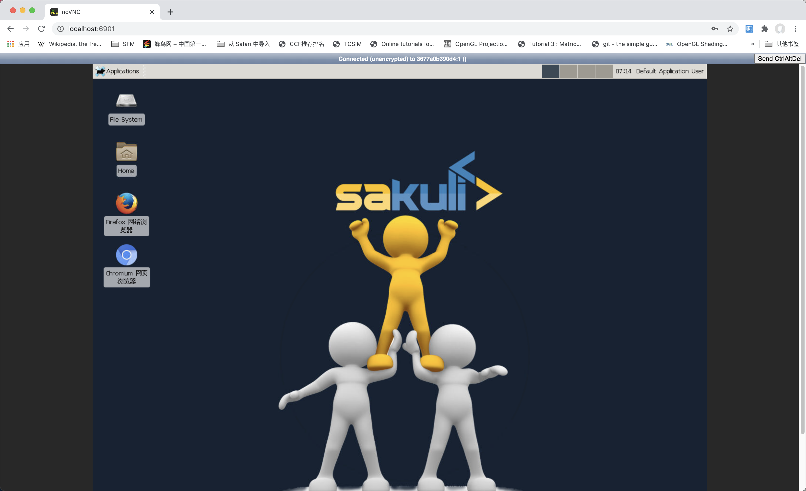
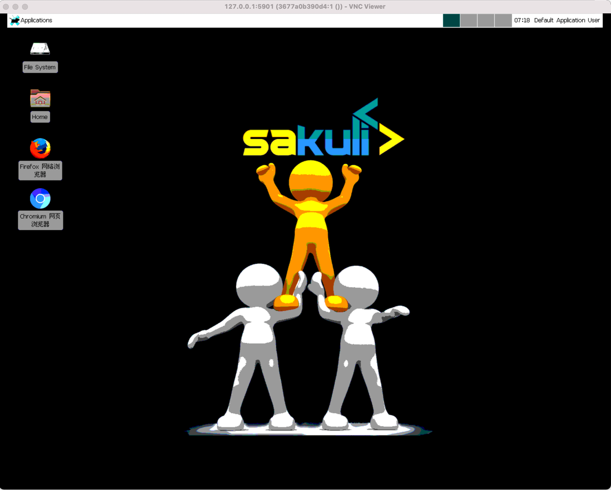

- [Linux发行版本](#linux发行版本)
- [Virtualbox安装Linux](#virtualbox安装linux)
- [Docker安装Linux](#docker安装linux)
# Linux发行版本
Linux是一种开源的操作系统，它有很多发行版本。主流的包括：
1. Debian及其派生版本Ubuntu、Linux Mint等
2. Fedora及其相关版本Red Hat Enterprise Linux、CentOS等
3. OpenSUSE等

另外Android操作系统也是基于Linux内核的，苹果的Mac和IOS则是Unix类操作系统（Linux是Unix系统的变种）。Linux系统使用广泛，嵌入式、手机、智能设备和云计算服务器，基本都运行Linux类操作系统。因此成为码农的前提条件是熟悉Linux系统。而且ROS（机器人操作系统）也只能运行在Linux上，要开发机器人，也必须掌握Linux系统。

几乎所有Linux的基本操作都是类似，只需要学习一款Linux操作系统，就能触类旁通。由于Android系统是高度定制化的（每个手机厂商都会定制），我们不太可能在不破解手机的情况下，直接操作Android系统。学习Linux操作的首选平台其实是MacOS（操作类似，GUI界面炫酷，App Store中可以下载大量常用软件），当然前提是预算足够。

大多数同学使用Windows电脑，要在Windows上学习Linux系统，有以下几种方式：

1. 在云计算平台（阿里云、腾讯云等）租用一台Linux云服务器，学生机的费用也很便宜，常有折扣。
2. 使用Virtualbox或者VMware之类的虚拟机软件安装Linux操作系统。
3. 使用Docker安装Linux操作系统。
4. 买一个[树莓派](https://www.raspberrypi.org)或者单板机，安装Linux操作系统。
5. 在Windows电脑上装双系统。

推荐的学习方式是1、2、3、4，方案5极不建议。下面主要说一下方案2和方案3。最后Linux的学习文档可以参考：

1. [Linux菜鸟教程](https://www.runoob.com/linux/linux-tutorial.html)
2. [Linux教程W3cSchool](https://www.w3cschool.cn/linux/linux-tutorial.html) 

# Virtualbox安装Linux
[Virtualbox](https://www.virtualbox.org)是一款开源的虚拟机软件。如果物理机安装了Windows10，利用Virtualbox可以安装各种Linux系统或者各种Windows系统。VMware也是类似的软件，性能比Virtualbox更好，但缺点是要付费。Docker也是一种虚拟机（更准确的说是容器引擎）。Virtualbox和Docker的最大区别在于（此处省略很多字），使用Virtualbox可以学习Linux的安装过程，并且可以安装带GUI界面的Linux版本（Docker也可以但需要安装远程桌面软件）。使用过程可以参考如下视频：

1. [Virtualbox+Ubuntu](https://www.bilibili.com/video/BV19J41157et?from=search&seid=15950630119177660241)
2. [Virtualbox+Centos](https://www.bilibili.com/video/BV1WC4y187Xo?from=search&seid=13008984999547985983)

# Docker安装Linux
Docker安装Linux非常简单，只需要拉取Linux镜像即可（centos或者ubuntu）。下面我们以centos镜像为基础，在centos上添加GUI界面、远程桌面等软件，[Dockerfile](code/Dockerfile)如下：
```Dockerfile
#以consol/centos-xfce-vnc镜像为基础
FROM consol/centos-xfce-vnc
#你可以在下面做进一步的定制
```
如果不做其他设置，也可以直接使用`consol/centos-xfce-vnc`镜像，如下：
```
docker run -d -p 5901:5901 -p 6901:6901 consol/centos-xfce-vnc
```

`consol/centos-xfce-vnc`镜像已经安装了vnc软件，你可以通过[vnc客户端](https://www.jb51.net/softs/605232.html)或者浏览器，访问该镜像中的桌面系统(访问密码是`vncpassword`)。





除非特殊情况，我们一般不会使用Linux的图像界面。一般普通用户才会使用图形界面，对于程序员而言，命令行界面的效率更高。现在应用程序也以网页或者手机App的图形界面为主。完全可以使用命令行来开发这类图形界面。
