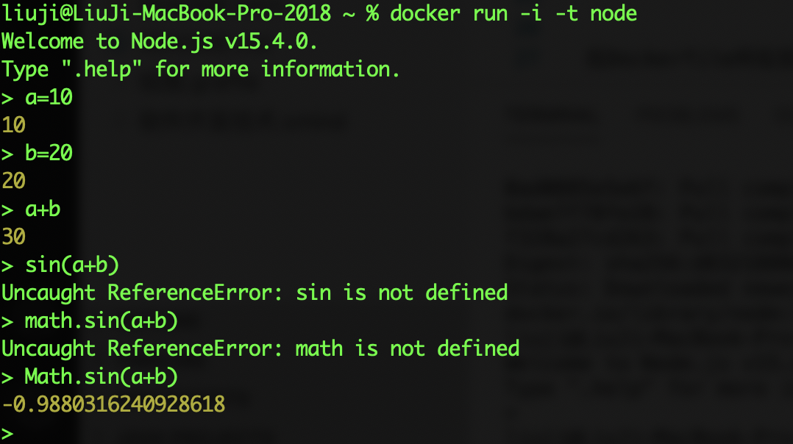
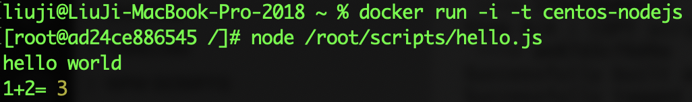
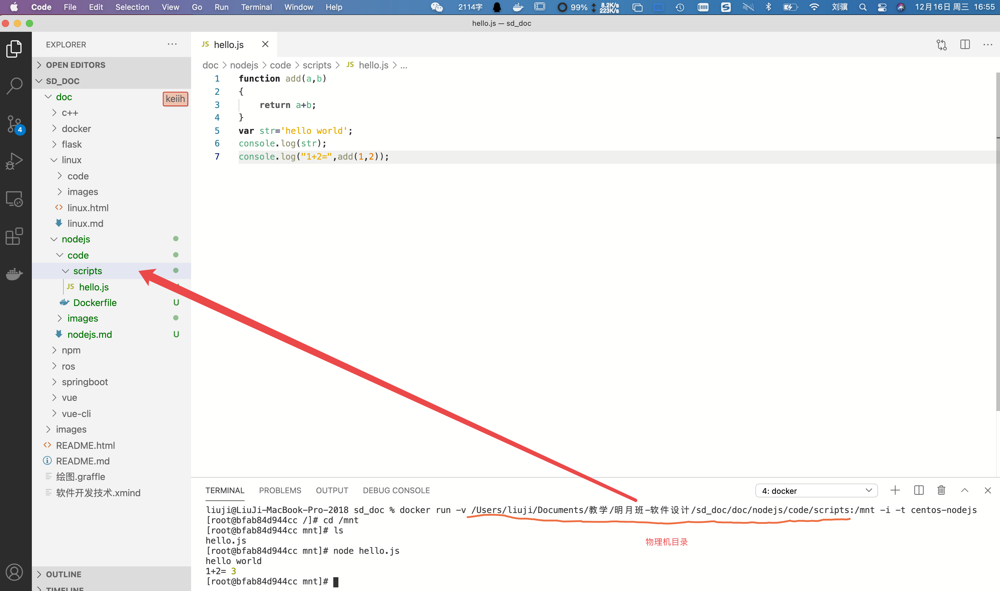

- [安装Node.js](#安装nodejs)
- [总结](#总结)
# 安装Node.js
Node.js是一个开源与跨平台的JavaScript运行时环境，它可以让我们在浏览器之外运行JavaScript代码。安装Node.js最简单的方法是使用官方的Docker镜像（几乎不用进行任何操作），如下拉取Node.js：

```
docker pull node
```
然后运行

```
docker run -i -t node
```

进入交互式环境



如果要运行物理机上编写JavaScript代码，就需要用'-v' 指令加载本地目录

另一种方式是在Linux镜像中安装Node.js，[Dockerfile](code/Dockerfile)如下：

```Dockerfile
FROM centos
# 安装Node.js 14
RUN dnf module -y install nodejs:14
#新建/root/scripts目录
RUN mkdir -p /root/scripts
#将scripts目录中的代码拷贝到/root/scripts
COPY scripts /root/scripts
```

在Dockerfile所在目录执行

```
docker build -t centos-nodejs:latest .
```

创建镜像。之后执行

```
docker run -i -t centos-nodejs
```

进入镜像。可以在`/root/scripts`目录下找到[hello.js](code/scripts/hello.js)这个JavaScript文件，hello.js的内容如下：

```JavaScript
function add(a,b)
{
    return a+b;
}
var str='hello world';
console.log(str);
console.log("1+2=",add(1,2));

```
在命令行下执行

```
node hello.js
```

即可执行该程序，结果如下：



你可以用`-v`参数将物理机目录挂载到虚拟机上，然后就可以用物理机的VSCode编辑JavaScript代码，并在虚拟机上运行，如下图所示：



# 总结
Node.js是NPM工具的基础，要使用NPM必须先安装Node.js。我们并不会直接使用Node.js，而是更多的使用NPM和vue-cli。所以只要你能运行上面的Docker镜像，就算是掌握了。