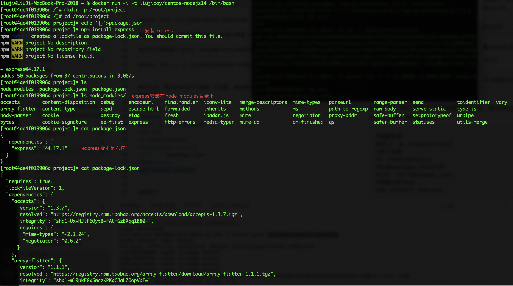
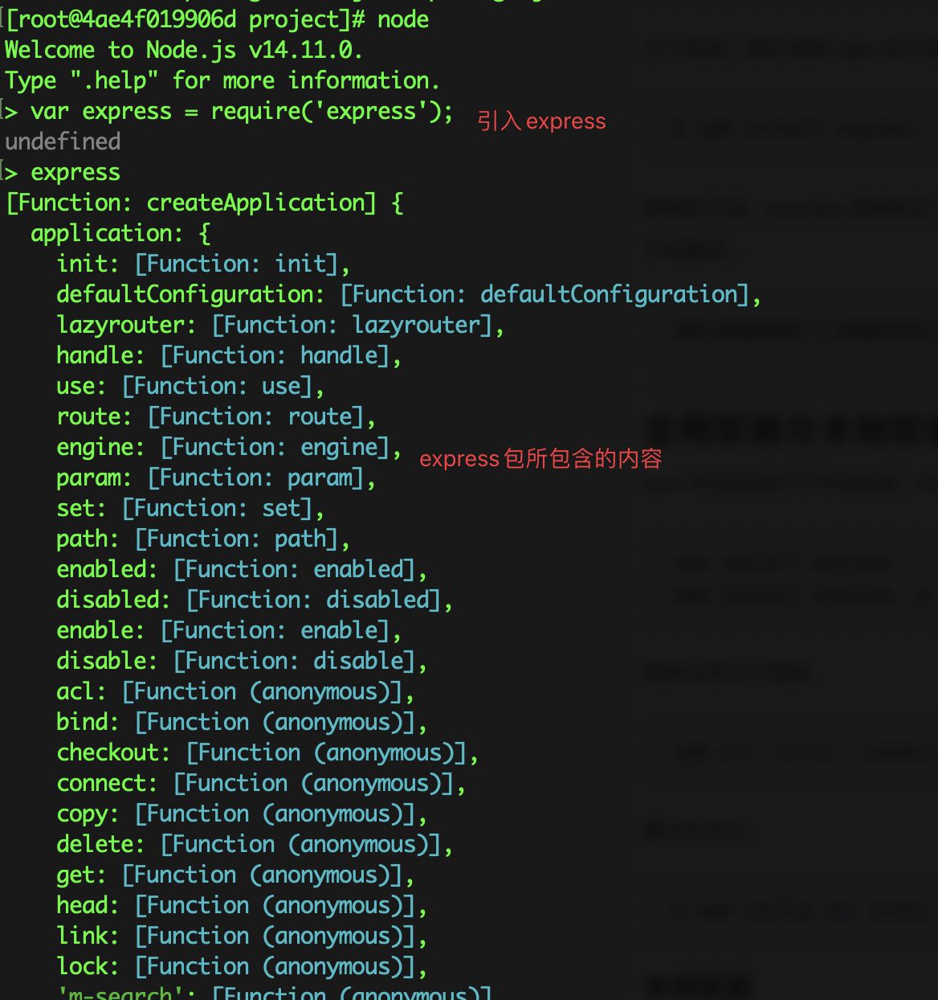

- [什么是NPM](#什么是npm)
- [使用NPM](#使用npm)
# 什么是NPM
NPM（Node package manager）是随着Node.js一起安装的包管理工具。换言之，如果已经安装了Node.js，也就意味着一起安装了NPM。

什么是包管理工具呢？如果你学过Python，应该知道Python的包管理工具是pip。NPM也实现pip一样的功能。它可以安装JavaScript包，或者将JavaScript项目打包发布。

# 使用NPM
我们利用之前的Node.js所创建的Docker镜像来说明NPM的使用方法。Dockerfile如下：
```Dockerfile
FROM centos
# 安装Node.js 14
RUN dnf module -y install nodejs:14
# 使用淘宝镜像，加快下载包的速度
RUN npm config set registry https://registry.npm.taobao.org
# 安装cnpm（非必须）
RUN npm install -g cnpm --registry=https://registry.npm.taobao.org
```
你可以复制这段代码，用`docker build`生成镜像。我已经将生成的镜像发布到了DockerHub（镜像名称`centos-nodejs14`），你也可以执行
```
docker pull liujiboy/centos-nodejs14
```
来拉取这个镜像，或者使用Node.js的官方镜像`node`也可以。

执行以下代码进入`bash`（bash是centos的命令行）
```
docker run -i -t liujiboy/centos-nodejs14 /bin/bash
```

执行之后，我们在命令行下创建一个目录，然后用npm在目录下安装`express`库，执行指令如下：

```shell
#创建目录
mkdir -p /root/project
#进入目录
cd /root/project
#生成package.json文件
echo '{}'>package.json
#安装express
npm install express
```

结果如下：



`package.json`文件记录了所安装的express包的版本。

`package-lock.json`文件记录了所安装的包实际从何处下载。

`node_modlues`是包的默认安装位置。

接下来我们可以在JavaScript编程中使用`express`包，如下：



如果要卸载`express`包，可以执行`uninstall`

```
npm uninstall express
```

npm的详细介绍可以参考[菜鸟NPM使用介绍](https://www.runoob.com/nodejs/nodejs-npm.html)。我们会做vue-cli和vue的学习中使用npm，掌握目前的知识已经足够了。