# 使用ROS镜像

执行如下指令启动`liujiboy/ros`镜像

```shell
docker run -it --rm -p 6080:80 -p 5900:5900 --name ros liujiboy/ros
```

启动之后可以通过浏览器、VNC客户端和命令行访问镜像。

浏览器方式访问：http://localhost:6080

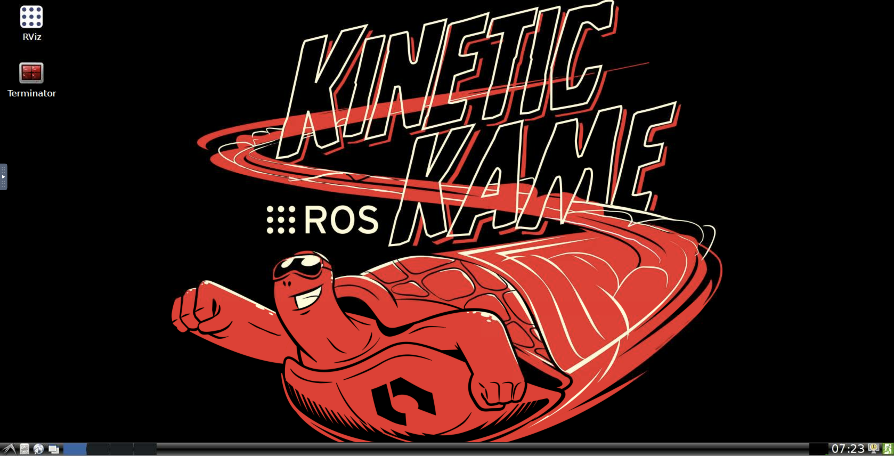

[VNC客户端](https://www.realvnc.com/en/connect/download/viewer/)如下设置：

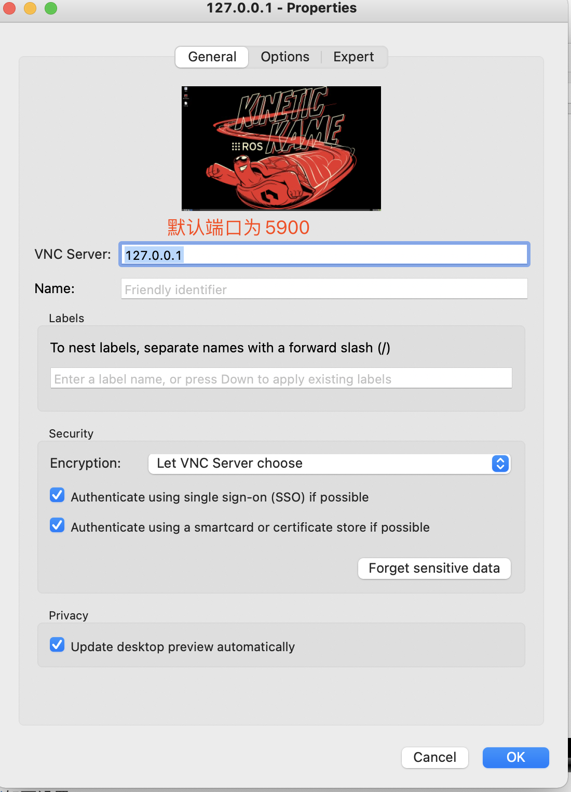

访问效果为：

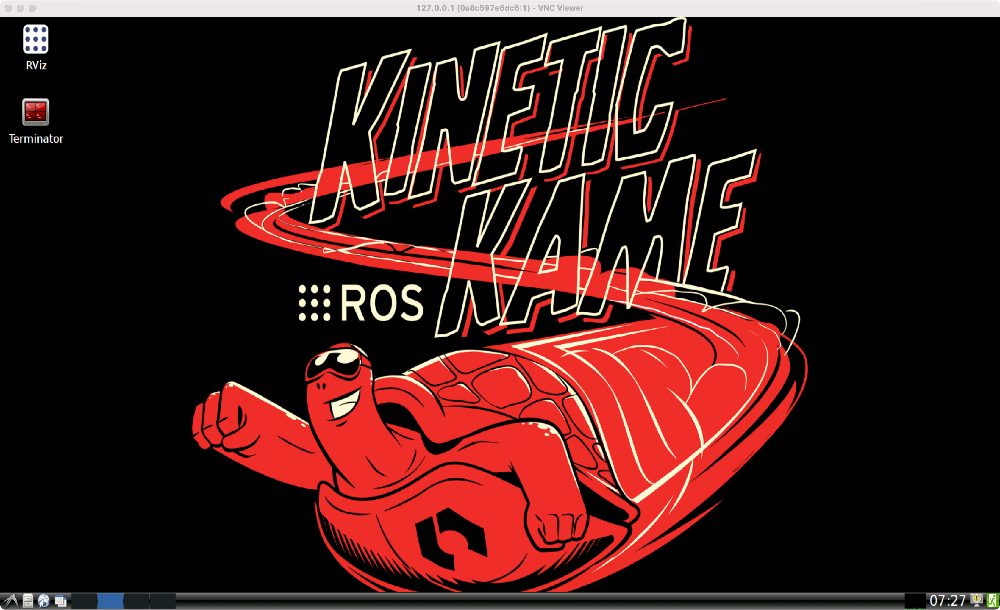

命令行访问执行如下指令：

```shell
docker exec -it ros /bin/bash
```

进入命令行界面：

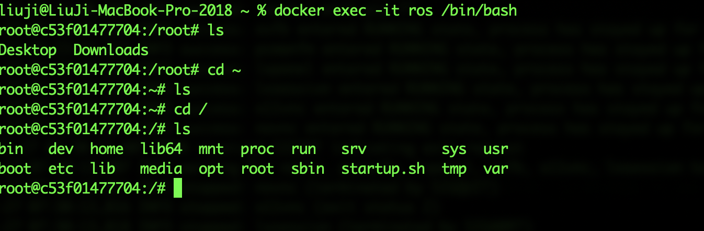

# 运行测试程序

启动镜像后，用浏览器方式（访问http://localhost:6080）进入，点击桌面上的`Terminator`图标进入终端，执行`roscore`启动ros：

```shell
roscore
```

效果如下：

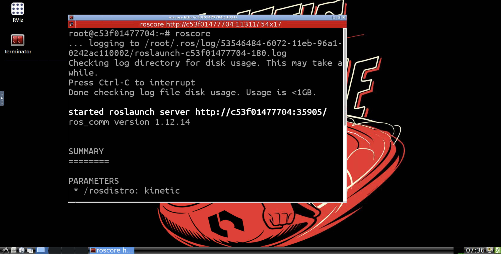

接着再打开一个`Terminator`，执行如下指令：

```shell
rosrun turtlesim turtlesim_node
```

屏幕上出现了一只小海龟：

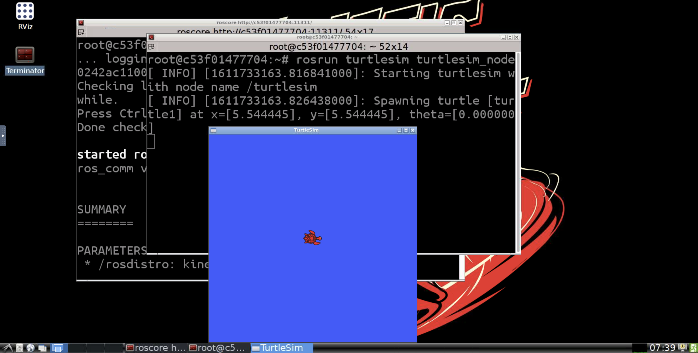

再打开一个`Terminator`，执行如下指令：

```shell
rosrun turtlesim turtle_teleop_key
```

现在我们可以用键盘的上下左右键控制海龟的移动

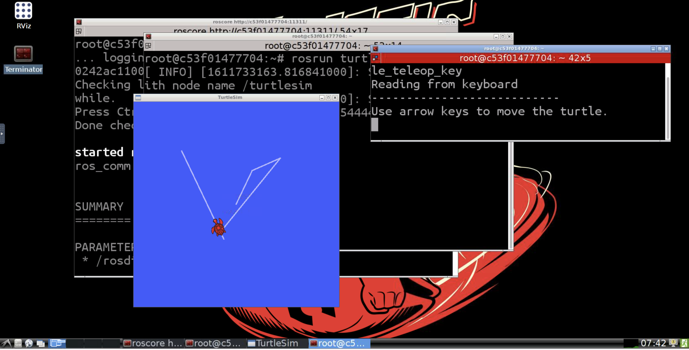

再打开一个`Terminator`，执行如下指令：

```shell
rqt_graph
```

可以看到已经启动的两个程序`turtlesim_node`和`turtle_teleop_key`之间的关系：

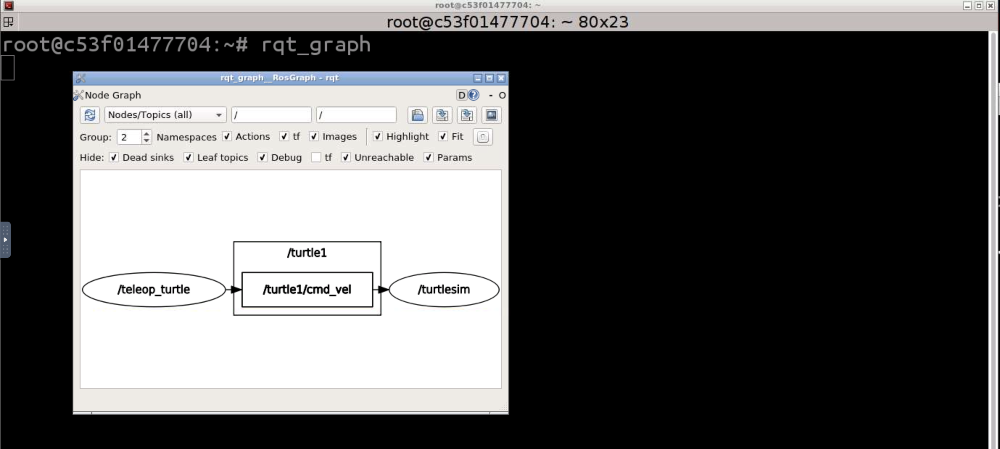

# 用VSCode开发ROS程序

## 为VSCode安装Docker扩展

安装Docker和Remote-Container两个扩展

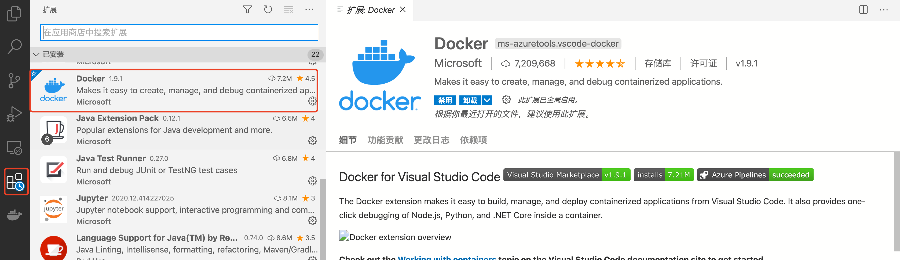

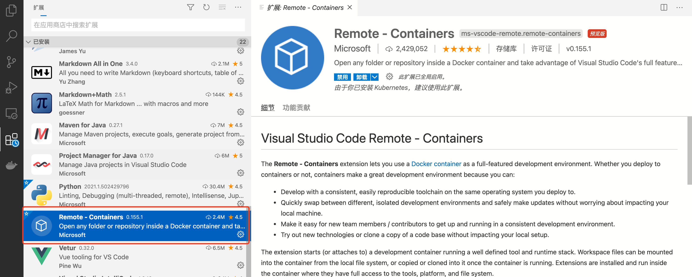

安装完毕之后，就可以在界面上看到已经启动的Docker容器

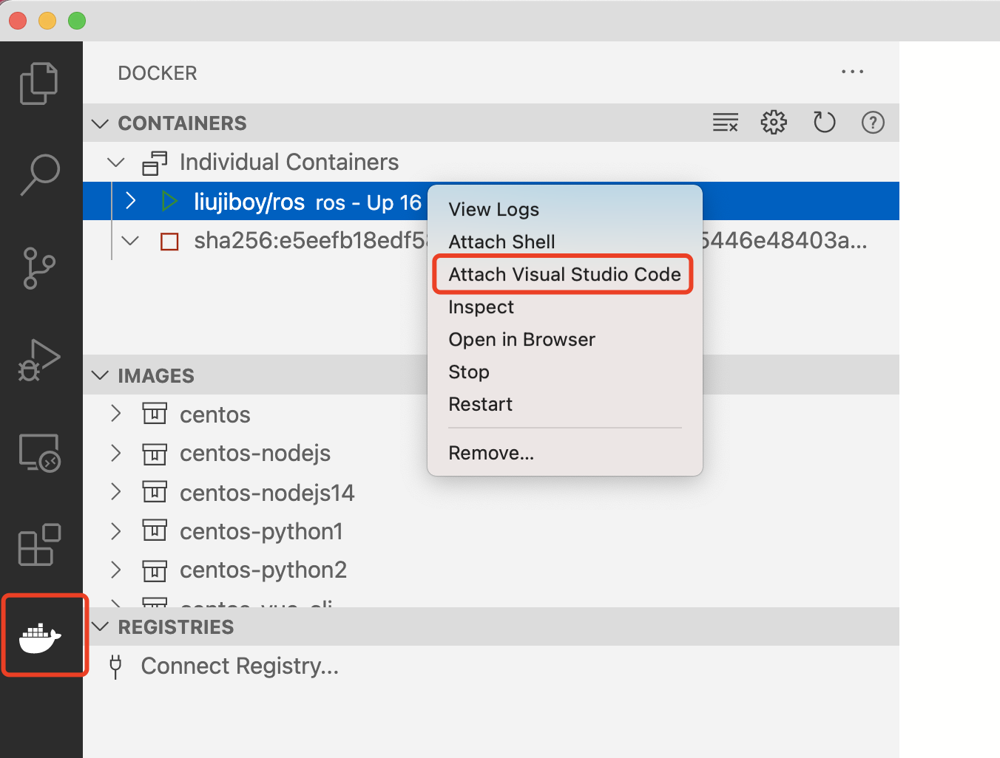

## VSCode关联docker容器

在上图中，选择`Attach Visual Studio Code`之后会打开一个新的VSCode窗口，该窗口就和容器是关联的

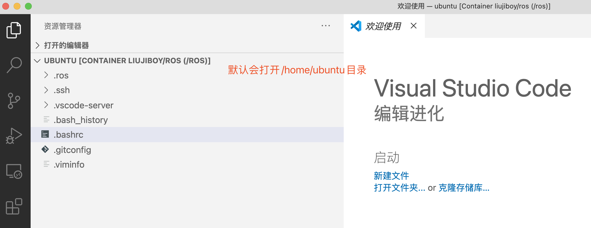

为了便于操作，我们在`/home/ubuntu`目录下新建一个Project目录，然后打开文件夹（打开`/home/ubuntu/Project`），打开终端进入到`/home/ubuntu/Project`，全部做完的效果如下：

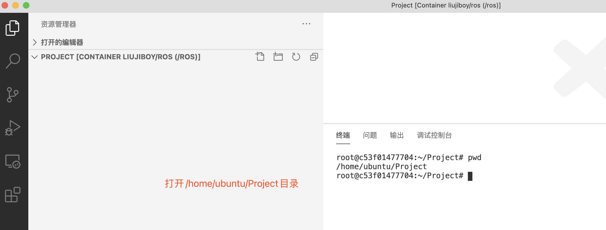

## 新建ROS项目

在`/home/ubuntu/Project`目录下依次执行如下指令

```shell
mkdir -p /home/ubuntu/Project/catkin_ws/src  #创建catkin_ws/src目录
cd /home/ubuntu/Project/catkin_ws/src #进入src目录
catkin_init_workspace #初始化项目
```

执行完成后创建了一个`CMakeLists.txt`

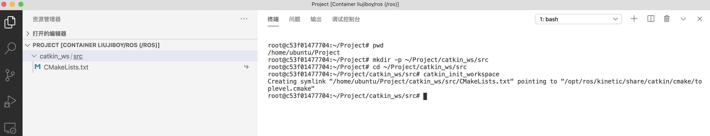

现在在命令行下继续执行如下命令：

```shell
cd ~/Project/catkin_ws
catkin_make
```

程序开始编译，编译完成后，结果如下：

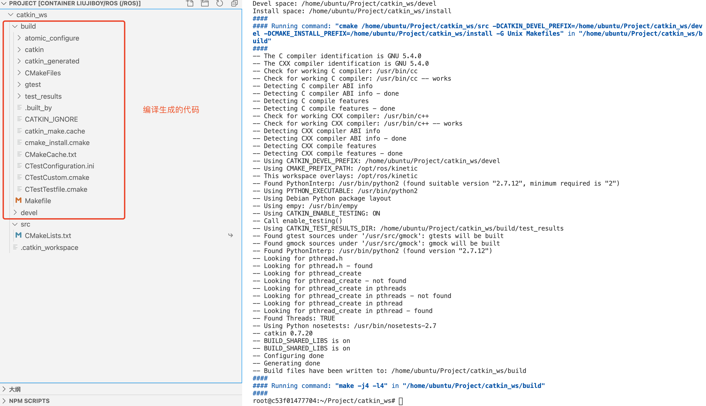

**注意：**`catkin_ws/build`和`catkin_ws/devel`下的代码是`catkin_make`指令自动生成的，我们只会在`catkin_ws/src`目录下编写代码，目前这个项目的代码为空。

## 发布者节点和订阅者节点程序

### 创建功能包

在命令行下执行如下指令：

```shell
cd /home/ubuntu/Project/catkin_ws/src
catkin_create_pkg ros_tutorials_topic message_generation std_msgs roscpp
```

`catkin_ws/src`目录下出现名称为`ros_tutorials_topic`的目录，目录下有一些建好的C++程序文件。

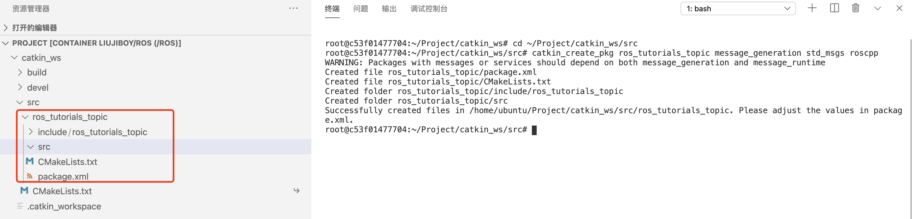

**catkin_create_pkg**的作用是创建功能包，并制定包依赖的功能包，它的命令格式为：

```
catkin_create_pkg [功能包名称] [依赖功能包1] [依赖功能包n]
```

换言之，上述指令创建了一个功能包`ros_tutorials_topic`，依赖于`message_generation` `std_msgs` `roscpp`。

该指令会创建`catkin_ws/src/ros_tutorials_topic/package.xml`内容如下：

```xml
<?xml version="1.0"?>
<package format="2">
  <name>ros_tutorials_topic</name>
  <version>0.0.0</version>
  <description>The ros_tutorials_topic package</description>

  <!-- One maintainer tag required, multiple allowed, one person per tag -->
  <!-- Example:  -->
  <!-- <maintainer email="jane.doe@example.com">Jane Doe</maintainer> -->
  <maintainer email="root@todo.todo">root</maintainer>


  <!-- One license tag required, multiple allowed, one license per tag -->
  <!-- Commonly used license strings: -->
  <!--   BSD, MIT, Boost Software License, GPLv2, GPLv3, LGPLv2.1, LGPLv3 -->
  <license>TODO</license>


  <!-- Url tags are optional, but multiple are allowed, one per tag -->
  <!-- Optional attribute type can be: website, bugtracker, or repository -->
  <!-- Example: -->
  <!-- <url type="website">http://wiki.ros.org/ros_tutorials_topic</url> -->


  <!-- Author tags are optional, multiple are allowed, one per tag -->
  <!-- Authors do not have to be maintainers, but could be -->
  <!-- Example: -->
  <!-- <author email="jane.doe@example.com">Jane Doe</author> -->


  <!-- The *depend tags are used to specify dependencies -->
  <!-- Dependencies can be catkin packages or system dependencies -->
  <!-- Examples: -->
  <!-- Use depend as a shortcut for packages that are both build and exec dependencies -->
  <!--   <depend>roscpp</depend> -->
  <!--   Note that this is equivalent to the following: -->
  <!--   <build_depend>roscpp</build_depend> -->
  <!--   <exec_depend>roscpp</exec_depend> -->
  <!-- Use build_depend for packages you need at compile time: -->
  <!--   <build_depend>message_generation</build_depend> -->
  <!-- Use build_export_depend for packages you need in order to build against this package: -->
  <!--   <build_export_depend>message_generation</build_export_depend> -->
  <!-- Use buildtool_depend for build tool packages: -->
  <!--   <buildtool_depend>catkin</buildtool_depend> -->
  <!-- Use exec_depend for packages you need at runtime: -->
  <!--   <exec_depend>message_runtime</exec_depend> -->
  <!-- Use test_depend for packages you need only for testing: -->
  <!--   <test_depend>gtest</test_depend> -->
  <!-- Use doc_depend for packages you need only for building documentation: -->
  <!--   <doc_depend>doxygen</doc_depend> -->
  <buildtool_depend>catkin</buildtool_depend>
  <build_depend>message_generation</build_depend>
  <build_depend>roscpp</build_depend>
  <build_depend>std_msgs</build_depend>
  <build_export_depend>roscpp</build_export_depend>
  <build_export_depend>std_msgs</build_export_depend>
  <exec_depend>roscpp</exec_depend>
  <exec_depend>std_msgs</exec_depend>


  <!-- The export tag contains other, unspecified, tags -->
  <export>
    <!-- Other tools can request additional information be placed here -->

  </export>
</package>
```

我们可以根据需要修改这个文件。

### 创建消息文件

在`catkin_ws/src/ros_tutorials_topic`目录下增加`msg`目录，并在其中编辑一个`MsgTutorial.msg`文件，文件内容如下：

```
time stamp 
int32 data
```

如下图：

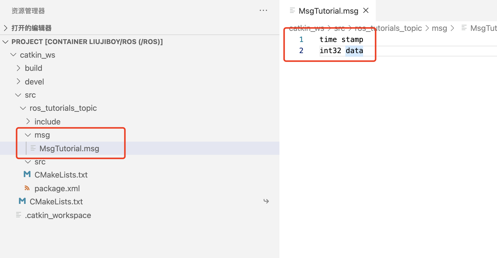


### **修改构建配置文件(CMakeLists.txt)**

修改``catkin_ws/src/ros_tutorials_topic/CMakeLists.txt`为如下：

```cmake
cmake_minimum_required(VERSION 2.8.3)
project(ros_tutorials_topic)

## catkin构建时需要的组件包。
## 是依赖包，是message_generation、 std_msgs和roscpp。
## 如果这些功能包不存在，在构建过程中会发生错误。
find_package(catkin REQUIRED COMPONENTS message_generation std_msgs roscpp)

## 消息声明:MsgTutorial.msg 
add_message_files(FILES MsgTutorial.msg)

## 这是设置依赖性消息的选项。
## 如果未安装std_msgs，则在构建过程中会发生错误。 
generate_messages(DEPENDENCIES std_msgs)

## catkin功能包选项，描述了库、catkin构建依赖项和系统依赖的功能包。 
catkin_package(
  LIBRARIES ros_tutorials_topic
  CATKIN_DEPENDS std_msgs roscpp
)
## 设置包含目录。 
include_directories(${catkin_INCLUDE_DIRS})

## topic_publisher节点的构建选项。
## 配置可执行文件、目标链接库和其他依赖项。
add_executable(topic_publisher src/topic_publisher.cpp)
add_dependencies(topic_publisher ${${PROJECT_NAME}_EXPORTED_TARGETS} ${catkin_EXPORTED_TARGETS}) 
target_link_libraries(topic_publisher ${catkin_LIBRARIES})

## topic_subscriber节点的构建选项。
add_executable(topic_subscriber src/topic_subscriber.cpp)
add_dependencies(topic_subscriber ${${PROJECT_NAME}_EXPORTED_TARGETS} ${catkin_EXPORTED_TARGETS}) 
target_link_libraries(topic_subscriber ${catkin_LIBRARIES})
```

### 创建发布者

在`catkin_ws/src/ros_tutorials_topic/src`中增加`topic_publisher.cpp`文件

```c++
#include "ros/ros.h" // ROS默认头文件
#include "ros_tutorials_topic/MsgTutorial.h" // MsgTutorial消息头文件( 构建后自动生成)
int main(int argc, char **argv)
{ 
    ros::init(argc, argv, "topic_publisher"); // 初始化节点名称
    ros::NodeHandle nh; // 声明一个节点句柄来与ROS系统进行通信
    // 声明发布者，创建一个使用ros_tutorials_topic功能包的MsgTutorial 消息文件的 
    // 发布者ros_tutorial_pub。话题名称是"ros_tutorial_msg"，
    // 消息文件发布者队列(queue)的大小设置为100
    ros::Publisher ros_tutorial_pub =nh.advertise<ros_tutorials_topic::MsgTutorial>("ros_tutorial_msg", 100); 
    // 设定循环周期。"10"是指10Hz，是以0.1秒间隔重复
    ros::Rate loop_rate(10); 
    // 以MsgTutorial消息文件格式声明一个 叫做msg的消息
    ros_tutorials_topic::MsgTutorial msg; 
    int count = 0; // 声明要在消息中使用的变量
    while (ros::ok())
    { 
        msg.stamp = ros::Time::now(); // 把当前时间传给msg的下级消息stamp
        msg.data = count; // 将变量count的值传给下级消息data
        ROS_INFO("send msg = %d", msg.stamp.sec);  // 显示stamp.sec消息
        ROS_INFO("send msg = %d", msg.stamp.nsec); // 显示stamp.nsec消息
        ROS_INFO("send msg = %d", msg.data);  // 显示data消息
        ros_tutorial_pub.publish(msg); // 发布消息
        loop_rate.sleep(); // 按照上面定义的循环周期进行暂歇
        ++count; // 变量count增加1
    } 
    return 0; 
}
```

### 创建订阅者

在`catkin_ws/src/ros_tutorials_topic/src`中增加`topic_subscriber.cpp`文件

```c++
#include "ros/ros.h" // ROS的默认头文件
#include "ros_tutorials_topic/MsgTutorial.h" // MsgTutorial消息头文件(构建后自动生成)
// 这是一个消息后台函数，
// 此函数在收到一个下面设置的名为ros_tutorial_msg的话题时候被调用。 
// 输入的消息是从ros_tutorials_topic功能包接收MsgTutorial消息。
void msgCallback(const ros_tutorials_topic::MsgTutorial::ConstPtr& msg) {
    ROS_INFO("recieve msg = %d", msg->stamp.sec);// 显示stamp.sec消息
    ROS_INFO("recieve msg = %d", msg->stamp.nsec); // 显示stamp.nsec消息
    ROS_INFO("recieve msg = %d", msg->data);  // 显示data消息
} 
int main(int argc, char **argv)
{ 
    ros::init(argc, argv, "topic_subscriber"); // 初始化节点名称
    ros::NodeHandle nh; // 声明用于ROS系统和通信的节点句柄
    // 声明订阅者，创建一个订阅者ros_tutorial_sub，
    // 它利用ros_tutorials_topic功能包的的MsgTutorial消息文件。
    // 话题名称是"ros_tutorial_msg"，订阅者队列(queue)的大小设为100。
    ros::Subscriber ros_tutorial_sub = nh.subscribe("ros_tutorial_msg", 100, msgCallback);
    // 用于调用后台函数，等待接收消息。在接收到消息时执行后台函数。
    ros::spin();
    return 0; 
}
```

### 执行构建

在命令行下执行如下指令：

```shell
cd /home/ubuntu/Project/catkin_ws
catkin_make
```

执行构建，构建成功后在`catkin_ws/devel/lib`下生成可执行文件

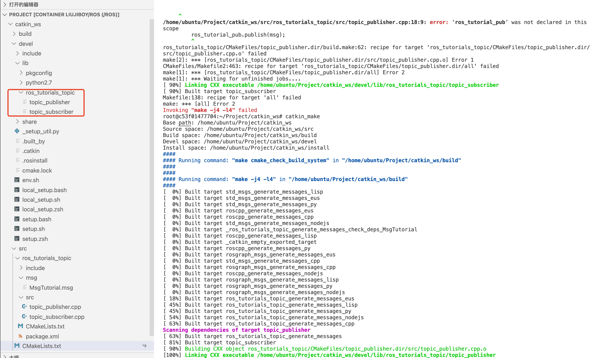

### 运行发布者和订阅者

在图形界面(http://localhost:6080)，打开两个`Terminator`，分别执行如下指令：

运行发布者

```shell
source /home/ubuntu/Project/catkin_ws/devel/setup.bash
cd /home/ubuntu/Project/catkin_ws
rosrun ros_tutorials_topic topic_publisher
```

运行订阅者

```shell
source /home/ubuntu/Project/catkin_ws/devel/setup.bash
cd /home/ubuntu/Project/catkin_ws
rosrun ros_tutorials_topic topic_subscriber
```

效果如下：

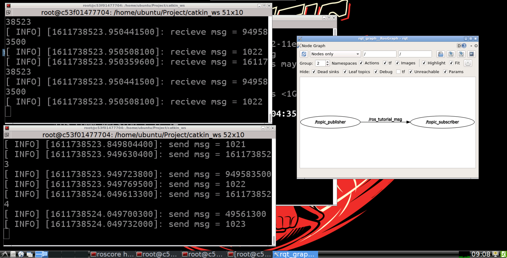

# 发布者和订阅者镜像

```shell
docker run -it --rm -p 6080:80 -p 5900:5900 --name ros liujiboy/ros_tutorials_topic
```

运行发布者

```shell
source /home/ubuntu/Project/catkin_ws/devel/setup.bash
cd /home/ubuntu/Project/catkin_ws
rosrun ros_tutorials_topic topic_publisher
```

运行订阅者

```shell
source /home/ubuntu/Project/catkin_ws/devel/setup.bash
cd /home/ubuntu/Project/catkin_ws
rosrun ros_tutorials_topic topic_subscriber
```

# 用Python3实现发布者和订阅者

用Python编写ROS程序比用C++更为简单。下面给出docker镜像`liujiboy/ros_python3`的构建过程：

```dockerfile
FROM liujiboy/ros
# 项目目录
ARG PROJECT_DIR=/home/ubuntu/Project/catkin_ws
# 源代码目录
ARG SOURCE_DIR=${PROJECT_DIR}/src
# 创建源代码目录
RUN mkdir -p ${SOURCE_DIR}
# 进入源代码目录
WORKDIR ${SOURCE_DIR}
# 初始化
RUN /bin/bash -c 'source /opt/ros/kinetic/setup.bash; \
    catkin_init_workspace'
# 进入项目目录
WORKDIR ${PROJECT_DIR}
# 构建
RUN /bin/bash -c 'source /opt/ros/kinetic/setup.bash; \ 
    catkin_make'
# 激活虚拟环境使用python3
RUN virtualenv -p /usr/bin/python3 venv
# 在虚拟环境下安装ros python包
RUN /bin/bash -c 'source venv/bin/activate; \
    pip3 install -i https://mirrors.aliyun.com/pypi/simple/ catkin_pkg pyyaml empy rospkg'
# 进入源代码目录
WORKDIR ${SOURCE_DIR}
# 创建功能包ros_python3 依赖message_generation std_msgs roscpp
RUN /bin/bash -c 'source /opt/ros/kinetic/setup.bash; \
    catkin_create_pkg ros_python3 message_generation std_msgs roscpp'
# 在源代码目录下创建一个scripts目录放置python文件
RUN mkdir -p ${SOURCE_DIR}/ros_python3/scripts
# 拷贝python脚本到项目
COPY scripts ${SOURCE_DIR}/ros_python3/scripts
# 给python脚本赋予执行权限
WORKDIR ${SOURCE_DIR}/ros_python3/scripts
RUN chmod +x listener.py
RUN chmod +x talker.py
RUN chmod +x talker2.py
# 拷贝启动脚本并赋予执行权限
COPY start_talker.sh /root
RUN chmod +x /root/start_talker.sh

COPY start_talker2.sh /root
RUN chmod +x /root/start_talker2.sh

COPY start_listener.sh /root
RUN chmod +x /root/start_listener.sh
```

**编写ROS程序并不需要在VSCode中用鼠标点来点去，更高效的方法是编写脚本，脚本定义了ROS程序编写的流程。这个流程是可复用的，后续可以在此基础上扩展（见[用Python3实现简单“机器人”控制](#用Python3实现简单"机器人"控制)）。**

执行下列代码，启动镜像：

```shell
docker run -it --rm -p 6080:80 -p 5900:5900 --name ros liujiboy/ros_python3
```

打开一个`Terminator`，先运行

```shell
roscore
```

运行发布者

```shell
/root/start_talker.sh
```

或者

```shell
/root/start_talker2.sh
```

运行订阅者

```shell
/root/start_listener.sh
```

镜像中使用的python代码见：https://github.com/liujiboy/dockerimages/tree/master/ros/ros_python3

# 用Python3实现简单“机器人”控制

docker镜像`liujiboy/ros_robot`的构建过程如下：

```dockerfile
FROM liujiboy/ros
# 项目目录
ARG PROJECT_DIR=/home/ubuntu/Project/catkin_ws
# 源代码目录
ARG SOURCE_DIR=${PROJECT_DIR}/src

# 创建源代码目录
RUN mkdir -p ${SOURCE_DIR}
# 进入源代码目录
WORKDIR ${SOURCE_DIR}
# 初始化
RUN /bin/bash -c 'source /opt/ros/kinetic/setup.bash; \
    catkin_init_workspace'
# 进入项目目录
WORKDIR ${PROJECT_DIR}
# 构建
RUN /bin/bash -c 'source /opt/ros/kinetic/setup.bash; \ 
    catkin_make'
# 激活虚拟环境使用python3
RUN virtualenv -p /usr/bin/python3 venv
# 在虚拟环境下安装ros python包
RUN /bin/bash -c 'source venv/bin/activate; \
    pip3 install -i https://mirrors.aliyun.com/pypi/simple/ catkin_pkg pyyaml empy rospkg pygame'
# 进入源代码目录
WORKDIR ${SOURCE_DIR}
# 创建功能包ros_python3 依赖message_generation std_msgs roscpp
RUN /bin/bash -c 'source /opt/ros/kinetic/setup.bash; \
    catkin_create_pkg ros_robot message_generation std_msgs roscpp'
# 在源代码目录下创建一个scripts目录放置python文件
RUN mkdir -p ${SOURCE_DIR}/ros_robot/scripts
# 拷贝python脚本到项目
COPY scripts ${SOURCE_DIR}/ros_robot/scripts
# 拷贝消息定义
COPY msg ${SOURCE_DIR}/ros_robot/msg
# 拷贝修改后的CMake文件
COPY CMakeLists.txt ${SOURCE_DIR}/ros_robot
# 构建消息
WORKDIR ${PROJECT_DIR}
RUN /bin/bash -c 'source /opt/ros/kinetic/setup.bash; \
    source venv/bin/activate;\
    catkin_make'

# 给python脚本赋予执行权限
WORKDIR ${SOURCE_DIR}/ros_robot/scripts
RUN chmod +x game.py
RUN chmod +x publish_speed.py

# 拷贝启动脚本并赋予执行权限
COPY start_game.sh /root
RUN chmod +x /root/start_game.sh

COPY start_publish_speed.sh /root
RUN chmod +x /root/start_publish_speed.sh
```

**可以看到，上述代码与[用Python3实现发布者和订阅者](#用Python3实现发布者和订阅者)非常类似，事实上这个代码就是在[用Python3实现发布者和订阅者](#用Python3实现发布者和订阅者)基础上修改的。编程是真正意义上的写代码，而不是动鼠标点来点去。**

执行下列代码，启动镜像：

```shell
docker run -it --rm -p 6080:80 -p 5900:5900 --name ros liujiboy/ros_robot
```

打开`Terminator`，先运行

```shell
roscore
```

运行"机器人"

```
/root/start_robot.sh
```

运行速度发布者

```
/root/start_publish_speed.sh
```

程序实现代码参考：https://github.com/liujiboy/dockerimages/tree/master/ros/ros_robot

# 如何部署ROS程序

我们在`liujiboy/ros_python3`程序的基础上修改，构造一个可以部署的`发布者和订阅者镜像`。

修改后的Docker镜像为`liujiboy/ros_python3_deploy`

```dockerfile
FROM liujiboy/ros
# 项目目录
ARG PROJECT_DIR=/home/ubuntu/Project/catkin_ws
# 源代码目录
ARG SOURCE_DIR=${PROJECT_DIR}/src
# 创建源代码目录
RUN mkdir -p ${SOURCE_DIR}
# 进入源代码目录
WORKDIR ${SOURCE_DIR}
# 初始化
RUN /bin/bash -c 'source /opt/ros/kinetic/setup.bash; \
    catkin_init_workspace'
# 进入项目目录
WORKDIR ${PROJECT_DIR}
# 构建
RUN /bin/bash -c 'source /opt/ros/kinetic/setup.bash; \ 
    catkin_make'
# 激活虚拟环境使用python3
RUN virtualenv -p /usr/bin/python3 venv
# 在虚拟环境下安装ros python包
RUN /bin/bash -c 'source venv/bin/activate; \
    pip3 install -i https://mirrors.aliyun.com/pypi/simple/ catkin_pkg pyyaml empy rospkg'
# 进入源代码目录
WORKDIR ${SOURCE_DIR}
# 创建功能包ros_python3 依赖message_generation std_msgs roscpp
RUN /bin/bash -c 'source /opt/ros/kinetic/setup.bash; \
    catkin_create_pkg ros_python3 message_generation std_msgs roscpp'
# 在源代码目录下创建一个scripts目录放置python文件
RUN mkdir -p ${SOURCE_DIR}/ros_python3/scripts
# 拷贝python脚本到项目
COPY scripts ${SOURCE_DIR}/ros_python3/scripts
# 给python脚本赋予执行权限
WORKDIR ${SOURCE_DIR}/ros_python3/scripts
RUN chmod +x listener.py
RUN chmod +x talker.py
RUN chmod +x talker2.py
# 拷贝启动脚本并赋予执行权限
COPY start_talker.sh /root
RUN chmod +x /root/start_talker.sh

COPY start_talker2.sh /root
RUN chmod +x /root/start_talker2.sh

COPY start_listener.sh /root
RUN chmod +x /root/start_listener.sh

# 设置ROS_MASTER_URI和ROS_HOSTNAME
ENV ROS_MASTER_URI http://rosmaster:11311
ENV ROS_HOSTNAME=rosmaster
```

其他代码与`liujiboy/ros_python3`相同，唯一区别是增加了`ROS_MASTER_URI`和`ROS_HOSTNAME`两个环境变量

```dockerfile
ENV ROS_MASTER_URI http://rosmaster:11311
ENV ROS_HOSTNAME=rosmaster
```

`ROS_MASTER_URI`和`ROS_HOSTNAME`指定了ROS主节点（Master节点）的地址，此处设置为`rosmaster`（可根据具体情况修改为ip地址或者域名）。

## 在单台主机上部署两个ROS程序

首先需要用docker利用如下指令创建一个名称为`ros`的network：

```shell
docker network create ros
```

创建成功后，执行`docker network list`可以看到创建好的`ros`网络名称

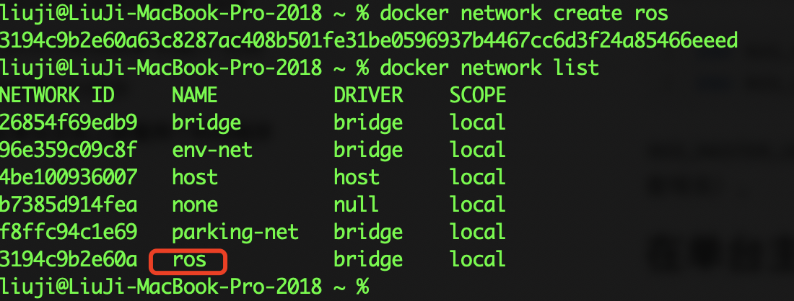

下面用两个指令启动两个不同的ros容器：

```shell
docker run -d --rm --network ros --network-alias rosmaster --name rosmaster liujiboy/ros_python3_deploy
docker run -d --rm --network ros --network-alias rosslave1 --name rosslave1 liujiboy/ros_python3_deploy
```

1. `-d`表示后台运行
2. `--rm`表示停止运行后自动删除容器
3. `--network ros`表示运行的容器加入到`ros`网络
4. `--network-alias rosmaster`表示该容器的网络名称是`rosmaster`(`ROS_MASTER_URI`和`ROS_HOSTNAME`指定的ROS主节点)
5. `--network-alias rosslave1`表示该容器的网络名称是`rosslave1`
6. `--name rosmaster`表示容器名称是`rosmaster`
7. `--name rosslave1`表示容器名称是`rosslave1`

**注意：**因为发布者订阅者程序不需要GUI界面，所以启动时没有映射http和vnc访问的端口，如果需要可以自行映射（参考前面的文档）。

下面在`rosmaster`上运行`roscore`和`talker.py`，指令如下：

```shell
docker exec -it rosmaster /bin/bash #进入rosmaster的命令行
roscore& #启动ros
/root/start_talker.sh #启动talker.py
```

在`rossalve1`上运行`listener.py`，指令如下：

```shell
docker exec -it rossalve1 /bin/bash #进入rossalve1的命令行
/root/start_listener.sh #启动listener.py
```

结果如下：

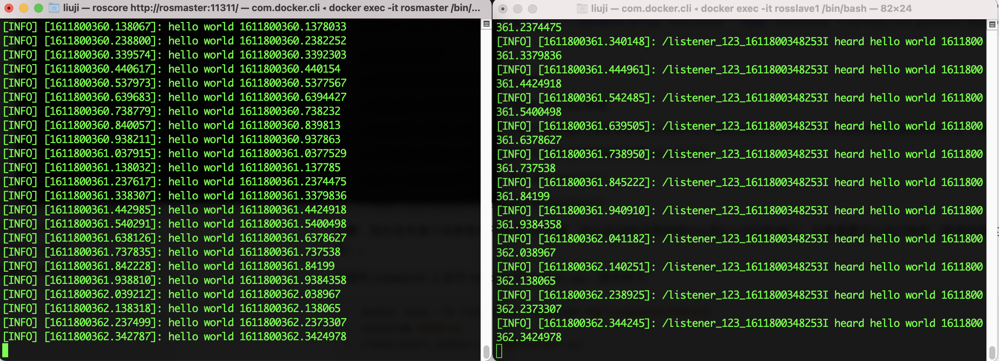

执行`docker ps`可以查看当前运行的容器：

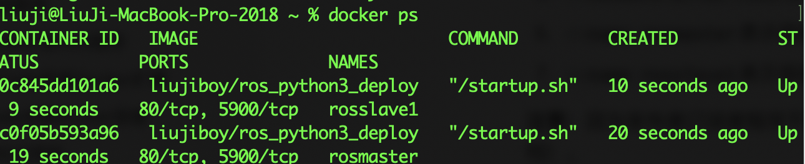

最后终止容器的执行可以运行如下指令：

```shell
docker stop rosslave1
docker stop rosmaster
```

## 在两台物理机上部署ROS程序

首先确保两台物理机在同一个网段，然后正确设置`ROS_MASTER_URI`和`ROS_HOSTNAME`指向ROS主节点的地址（运行主节点的），两台主机分别启动ROS镜像，并映射相应端口（例如11311）。例如两台主机域名和ip地址分别如下：

```properties
rosmaster 192.168.0.1 #作为ROS主节点
rosslave1 192.168.0.2
```

设置`ROS_MASTER_URI`和`ROS_HOSTNAME`两个环境变量为

```dockerfile
ENV ROS_MASTER_URI http://rosmaster:11311
ENV ROS_HOSTNAME=rosmaster
```

或者

```dockerfile
ENV ROS_MASTER_URI http://192.168.0.1:11311
ENV ROS_HOSTNAME=192.168.0.1
```

**注意：**采用域名方式比IP地址更加灵活，推荐采用域名方式。

以主机模式在两台物理机上分别启动ROS容器

```shell
docker run -d --rm --net=host --name rosmaster liujiboy/ros_python3_deploy # 192.168.0.1上运行
docker run -d --rm --net=host --name rosslave1 liujiboy/ros_python3_deploy # 192.168.0.2上运行
```

`--net=host`采用主机模式启动容器，自动映射虚拟机的网络端口。

**注意：**采用`--net=host`模式，主机和虚拟机开放的端口可能出现冲突，应根据情况关闭主机或者虚拟机的网络端口。

**`--net=host`模式自动端口映射仅在Linux系统下有效**，考虑到大多数机器人系统均采用Linux，所以这并不是很大的问题。

# 采用官方ROS镜像

官方提供ROS2版本的[镜像](https://hub.docker.com/_/ros)，ROS2比ROS1的编程更简单，但ROS1使用更广泛。随着ROS2的逐渐发展，未来几年ROS2肯定会逐步提到ROS1。

下面我们依据官方的[publisher and subscriber文档](https://index.ros.org/doc/ros2/Tutorials/Writing-A-Simple-Py-Publisher-And-Subscriber/)构建docker镜像`liujiboy/ros2_pubsub`。Dockerfile如下：

```dockerfile
FROM ros:foxy
# 进入/root目录
WORKDIR /root
# 创建项目目录
RUN mkdir -p /root/ros_ws
# 进入项目目录
WORKDIR /root/ros_ws
# 创建py_pubsub
RUN /bin/bash -c 'source /opt/ros/$ROS_DISTRO/setup.bash;\
    ros2 pkg create --build-type ament_python py_pubsub'
# 拷贝python文件到目录
COPY  scripts /root/ros_ws/py_pubsub/py_pubsub
# 拷贝package.xml、setup.cfg和setup.py
COPY  config /root/ros_ws/py_pubsub
# 进入项目目录
WORKDIR /root/ros_ws
# 构建
RUN colcon build --packages-select py_pubsub

# 拷贝启动脚本，赋予启动权限
COPY start_talker.sh /root
RUN chmod +x /root/start_talker.sh

COPY start_listener.sh /root
RUN chmod +x /root/start_listener.sh
```

Dockerfile中使用到的代码参考：https://github.com/liujiboy/dockerimages/tree/master/ros2/ros2_pubsub

如果已经用docker创建了`ros`网络，则分别执行如下代码：

```shell
docker run -it --rm --network ros --network-alias pub --name pub liujiboy/ros2_pubsub /root/start_talker.sh
docker run -it --rm --network ros --network-alias sub --name sub liujiboy/ros2_pubsub /root/start_listener.sh
```

运行结果如下：

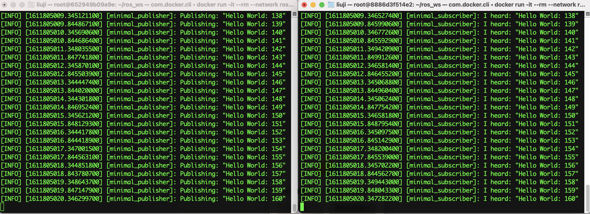