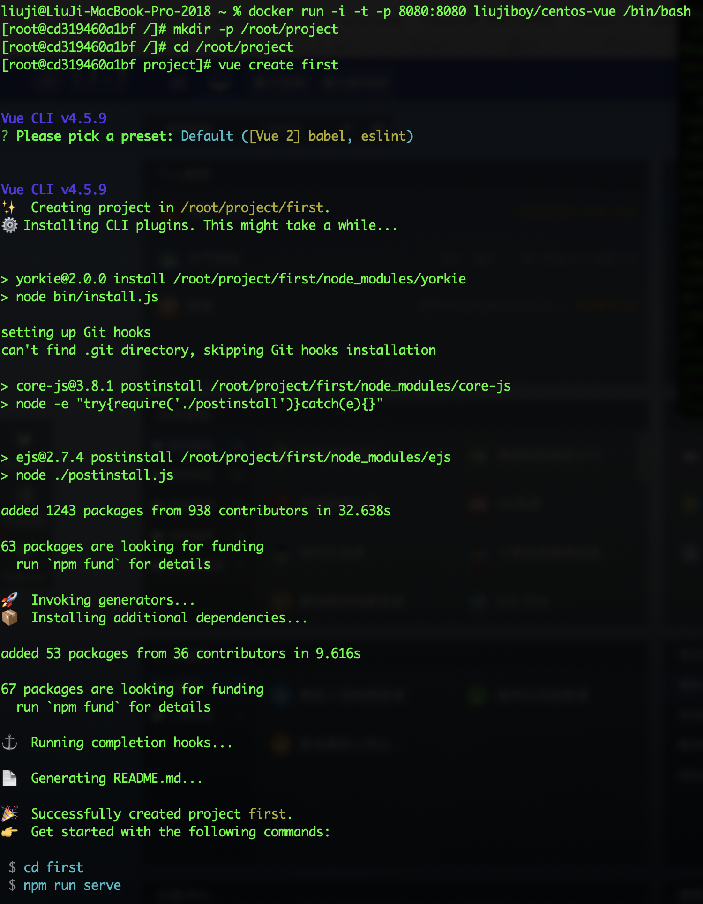
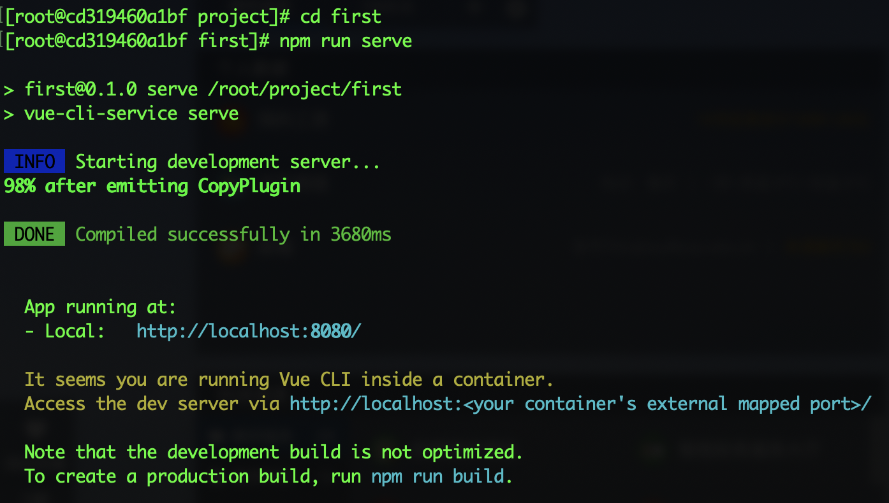
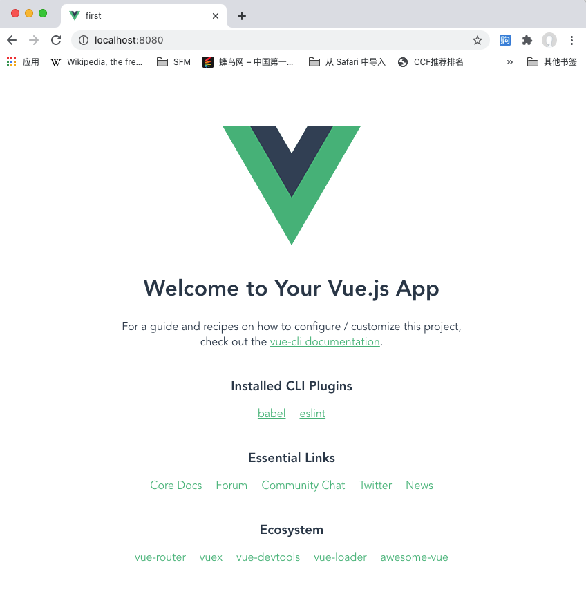

- [什么是vue-cli](#什么是vue-cli)
- [vue-cli的使用](#vue-cli的使用)
# 什么是vue-cli
vue-cli是vue开发的命令行程序。vue是一款JavaScript前端页面开发框架。我们仍然用docker来安装vue-cli。[Dockerfile](code/Dockerfile)如下：

```Dockerfile
#以liujiboy/centos-nodejs14镜像为基础
from liujiboy/centos-nodejs14
#全局安装vue-cli
RUN npm install -g @vue/cli
```

你可以自己构建这个镜像，也可以使用我构建好的镜像`liujiboy/centos-vue`。

# vue-cli的使用
下面我们启动镜像，用vue-cli创建一个vue项目，并且启动它。

```
docker run -i -t -p 8080:8080 liujiboy/centos-vue /bin/bash
```

启动后在容器内执行如下shell指令：
```
mkdir -p /root/project
cd /root/project
vue create first
```

`vue create first`指令会在`/root/project`目录下创建一个名为`first`的vue项目。



接着我们执行这个项目，进入first目录，执行`npm run serve`

```
cd first
npm run serve
```

此时会启动一个开发服务器



打开浏览器访问`http://localhost:8080`既可以看到运行效果：



vue-cli的完整文档参考[vue-cli官方文档](https://cli.vuejs.org/zh/guide/)