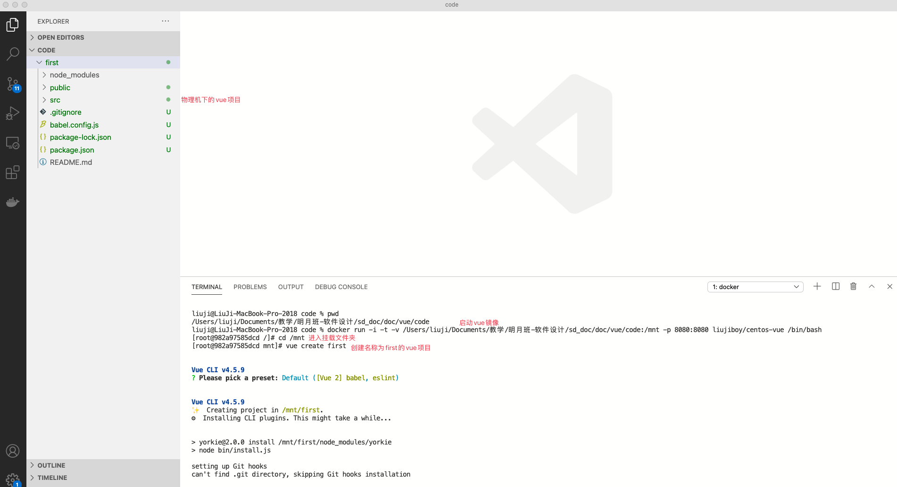
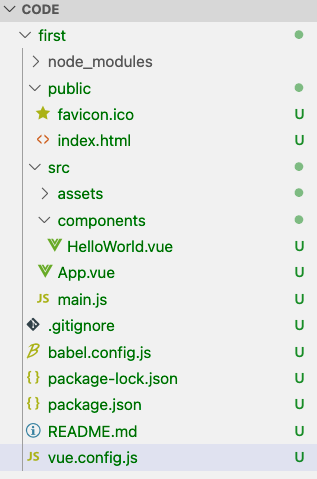
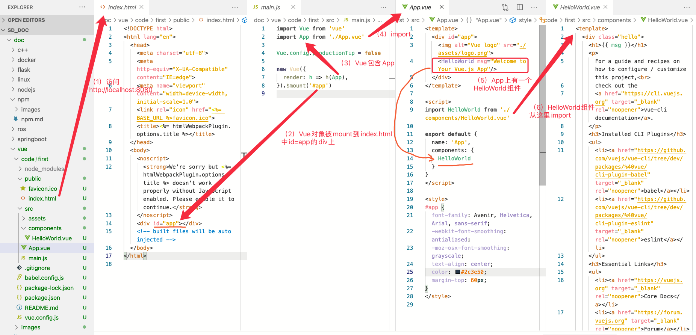
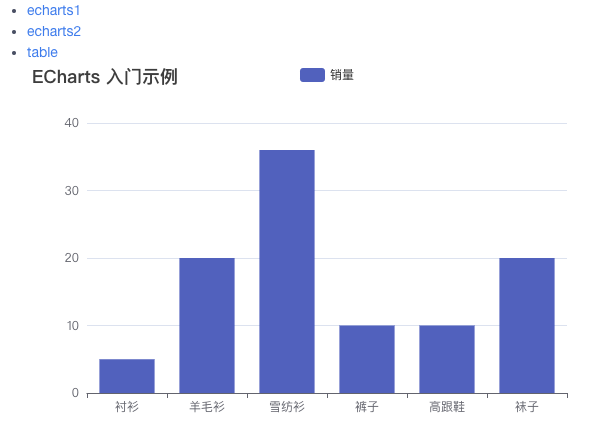
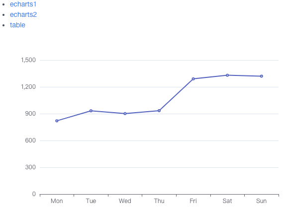
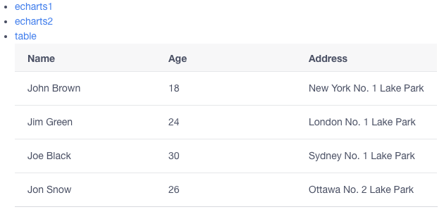

- [什么是vue](#什么是vue)
- [使用docker镜像开发vue](#使用docker镜像开发vue)
- [vue项目的结构](#vue项目的结构)
- [访问http://localhost:8080发生了什么？](#访问httplocalhost8080发生了什么)
- [使用vue-router、echarts和iview](#使用vue-routerecharts和iview)
- [打包发布](#打包发布)
# 什么是vue
vue是一套构建web用户界面的JavaScript框架。详细的文档可以参考：
1. [菜鸟vue教程](https://www.runoob.com/vue2/vue-tutorial.html)
2. [vue官方教程](https://cn.vuejs.org)

官方教程和菜鸟教程不是基于`vue-cli`的教程（官方不推荐新手使用`vue-cli`）。而我们的教程是基于`vue-cli`的教程，因此你应该首先阅读菜鸟vue教程或者vue官方教程，对vue开发有一定了解，然后再阅读剩下的文档。

# 使用docker镜像开发vue
我们使用`liujiboy/centos-vue`镜像挂载本地目录来开发vue程序。执行指令如下：
```
docker run -i -t -v [物理机目录]:/mnt -p 8080:8080 liujiboy/centos-vue /bin/bash
```

其中`[物理机目录]`请替换成vue项目在本机放置的位置，`/mnt`是虚拟机上挂载物理机目录的位置，`-p 8080:8080`将虚拟机上`8080`端口映射到本机8080端口（因为vue的开发服务器会默认启动该端口）。我们可以用VSCode打开`物理机目录`，从而实现`在物理机下编辑vue文件，在虚拟机上运行测试`。效果如下：



之后执行`npm run serve`即可在浏览器中访问`http://localhost:8080`访问到页面（见[vue-cli文档](../vue-cli/vue-cli.md)）。

# vue项目的结构
默认的vue项目包含如下目录：
1. node_modules：参考[npm文档](../npm/npm.md)，该目录放项目安装的JavaScript包。
2. public：运行web项目后，外部可以直接访问的资源，比如html页面和图片等。
3. src：JavaScript源代码
4. babel.config.js：babel的配置文件，项目默认会使用babel，目前不用管它。
5. package.json：执行`npm install`时，会依据该文件中的设置安装包（如果node_modules或者全局没有）。
6. package-lock.json：描述 node_modules 文件中所有模块的版本信息，模块来源及依赖的小版本信息；当版本升级，使用 npm install 命令时，会安装 package.json 中指定的大版本的最新版本。

项目开发所涉及的文件主要包含在`public`和`src`目录下，`package.json`和`package-lock.json`由`npm`命令来管理，一般不需要主动设置。

除了上述文件，我们还可以增加一个`vue.config.js`文件，用于项目的进一步配置，该文件的默认内容为：
```javascript
module.exports={

}
```
`first`项目的目录结构如下：



# 访问http://localhost:8080发生了什么？

下图给出了访问`http://localhost:8080`所发生的事情



访问`http://localhost:8080`的流程如下：
1. 访问index.html,index.html导致main.js的执行
2. main.js创建vue对象，并将其mount到index.html上的div元素（id=app）
3. Vue元素包含App对象，App对象在App.vue中定义
4. App.vue中包含HelloWorld组件，HelloWorld组件在HelloWorld.vue中定义

Vue默认是单页应用，在实际开发中，只有一个`index.html`且一般不修改。`src\components`中放置组件，并在`src\App.vue`中使用，`src\main.js`做一些公共的设置。

单页vue应用的核心理念是`将页面划分为组件（component）,通过组合、切换各类组件，构建多页面应用（实际上只有一个index.html）`。下面我们看一个具体的例子。

# 使用vue-router、echarts和iview
我们首先新建一个名为`second`的项目，然后安装`vue-router`、`echarts`和`iview`库，代码如下：
```
vue create second
cd second
npm install vue-router
npm install echarts
npm install view-design
```
[vue-router](https://router.vuejs.org/zh/)是官方的路由管理库。

[echarts](https://echarts.apache.org/zh/index.html)是一个图表库。

[iview](https://www.iviewui.com/docs/introduce)是基于vue的gui组件库。

具体的学习大家可以直接看官方文档。

下面我们首先创建3个`组件(component)`，分别是[src/components/Echarts1.vue](code/second/src/components/Echarts1.vue)、[src/components/Echarts2.vue](code/second/src/components/Echarts2.vue)和[src/components/Table.vue](code/second/src/components/Table.vue)。代码分别如下：

`Echharts1.vue`

```html
<template>
  <div style="height: 100%; margin: 0">
    <div id="main" style="width: 600px; height: 400px"></div>
  </div>
</template>
<script>
import * as echarts from 'echarts'
export default {
  methods: {
    myEcharts() {
      // 基于准备好的dom，初始化echarts实例
      var myChart = echarts.init(document.getElementById("main"));

      // 指定图表的配置项和数据
      var option = {
        title: {
          text: "ECharts 入门示例",
        },
        tooltip: {},
        legend: {
          data: ["销量"],
        },
        xAxis: {
          data: ["衬衫", "羊毛衫", "雪纺衫", "裤子", "高跟鞋", "袜子"],
        },
        yAxis: {},
        series: [
          {
            name: "销量",
            type: "bar",
            data: [5, 20, 36, 10, 10, 20],
          },
        ],
      };

      // 使用刚指定的配置项和数据显示图表。
      myChart.setOption(option);
    },
  },
  mounted() {
    this.myEcharts();
  },
};
</script>
<style>
</style>
```

`Echharts2.vue`

```html
<template>
  <div style="height: 100%; margin: 0">
    <div id="main" style="width: 600px; height: 400px"></div>
  </div>
</template>

<script>
import * as echarts from "echarts";
export default {
  methods: {
    myEcharts() {
      // 基于准备好的dom，初始化echarts实例
      var myChart = echarts.init(document.getElementById("main"));

      // 指定图表的配置项和数据
      var option = {
        xAxis: {
          type: "category",
          data: ["Mon", "Tue", "Wed", "Thu", "Fri", "Sat", "Sun"],
        },
        yAxis: {
          type: "value",
        },
        series: [
          {
            data: [820, 932, 901, 934, 1290, 1330, 1320],
            type: "line",
          },
        ],
      };

      // 使用刚指定的配置项和数据显示图表。
      myChart.setOption(option);
    },
  },
  mounted() {
    this.myEcharts();
  },
};
</script>
<style>
</style>
```

`Table.vue`
```html
<template>
    <Table :columns="columns1" :data="data1"></Table>
</template>
<script>
    export default {
        data () {
            return {
                columns1: [
                    {
                        title: 'Name',
                        key: 'name'
                    },
                    {
                        title: 'Age',
                        key: 'age'
                    },
                    {
                        title: 'Address',
                        key: 'address'
                    }
                ],
                data1: [
                    {
                        name: 'John Brown',
                        age: 18,
                        address: 'New York No. 1 Lake Park',
                        date: '2016-10-03'
                    },
                    {
                        name: 'Jim Green',
                        age: 24,
                        address: 'London No. 1 Lake Park',
                        date: '2016-10-01'
                    },
                    {
                        name: 'Joe Black',
                        age: 30,
                        address: 'Sydney No. 1 Lake Park',
                        date: '2016-10-02'
                    },
                    {
                        name: 'Jon Snow',
                        age: 26,
                        address: 'Ottawa No. 2 Lake Park',
                        date: '2016-10-04'
                    }
                ]
            }
        }
    }
</script>
```

接着修改`App.vue`，代码如下：
```html
<template>
  <div id="app" style="height: 100%; width:600px;margin: 0 auto">
 
      <ul>
        <li><router-link to="/echarts1">echarts1</router-link></li>
        <li><router-link to="/echarts2">echarts2</router-link></li>
        <li><router-link to="/table">table</router-link></li>
      </ul>
      <router-view />
  </div>
</template>
<script>
</script>
<style>
</style>
```
`router-link`和`router-view`配合使用，当点击`echarts1`时，在中显示`/echarts1`的内容，当点击`echarts2`时，在中显示`/echarts2`的内容，当点击`table`时，在中显示`/table`的内容。

`/echarts1`、`/echarts2`、`/table`与组件的关系在`main.js`中设置，代码如下：
```javascript
import Vue from 'vue'
import App from './App.vue'
Vue.config.productionTip = false
//设置iview
import ViewUI from 'view-design'
import 'view-design/dist/styles/iview.css';
Vue.use(ViewUI);
//设置vue-router
import VueRouter from "vue-router"
Vue.use(VueRouter);
var config = {
  routes: [
    {
      path: "/echarts1",
      component: () => import("@/components/Echarts1.vue"),
    },
    {
      path: "/echarts2",
      component: () => import("@/components/Echarts2.vue"),
    },
    {
      path: "/table",
      component: () => import("@/components/Table.vue"),
    }
  ],
  mode: "hash"
}
var router = new VueRouter(config);

new Vue({
  render: h => h(App),
  router //设置路由
}).$mount('#app')
```

程序运行之后，界面显示如下（不同链接切换不同组件）：






# 打包发布
开发完成之后运行`npm run build`就可以打包，生成的文件放在`dist`目录下。实际的部署通常会采用Docker+Nginx，同学们可以上网搜索，这里简单提供一个[教程](https://www.cnblogs.com/dotnet261010/p/12616149.html)。