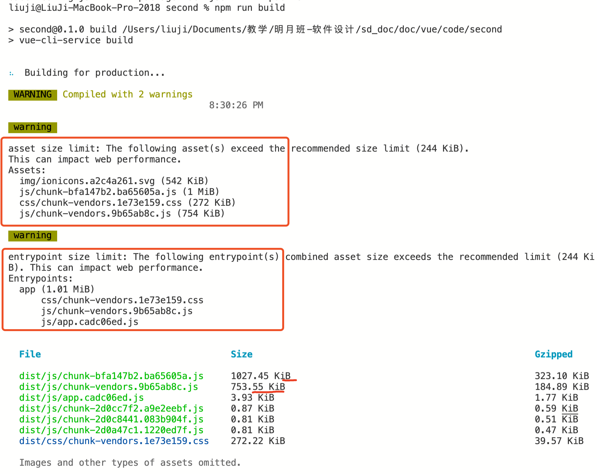
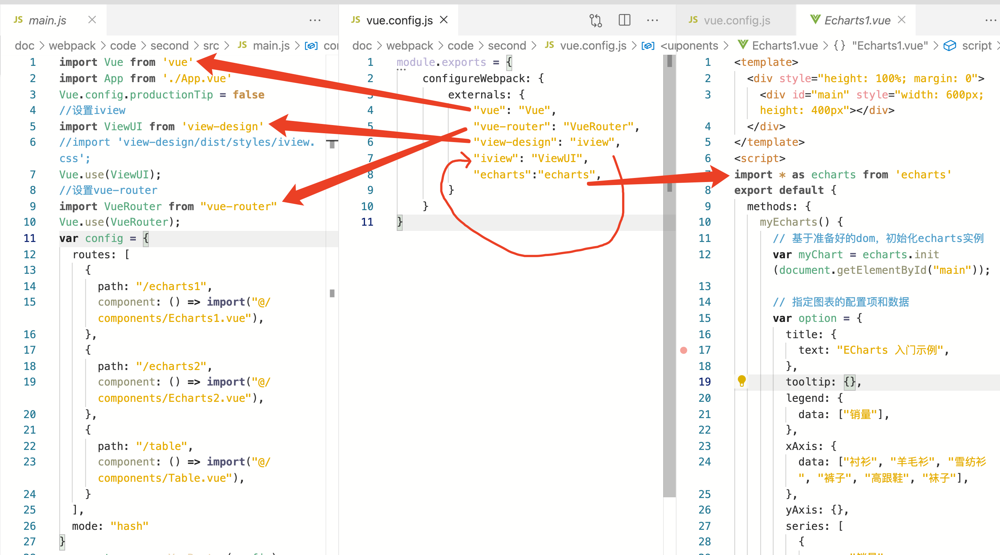
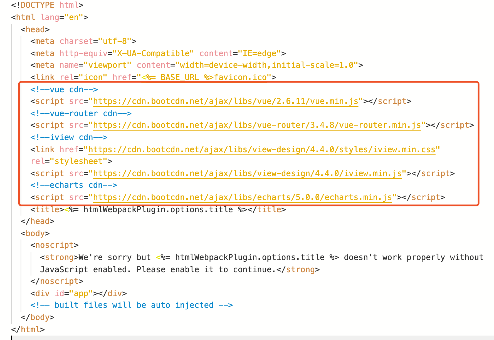
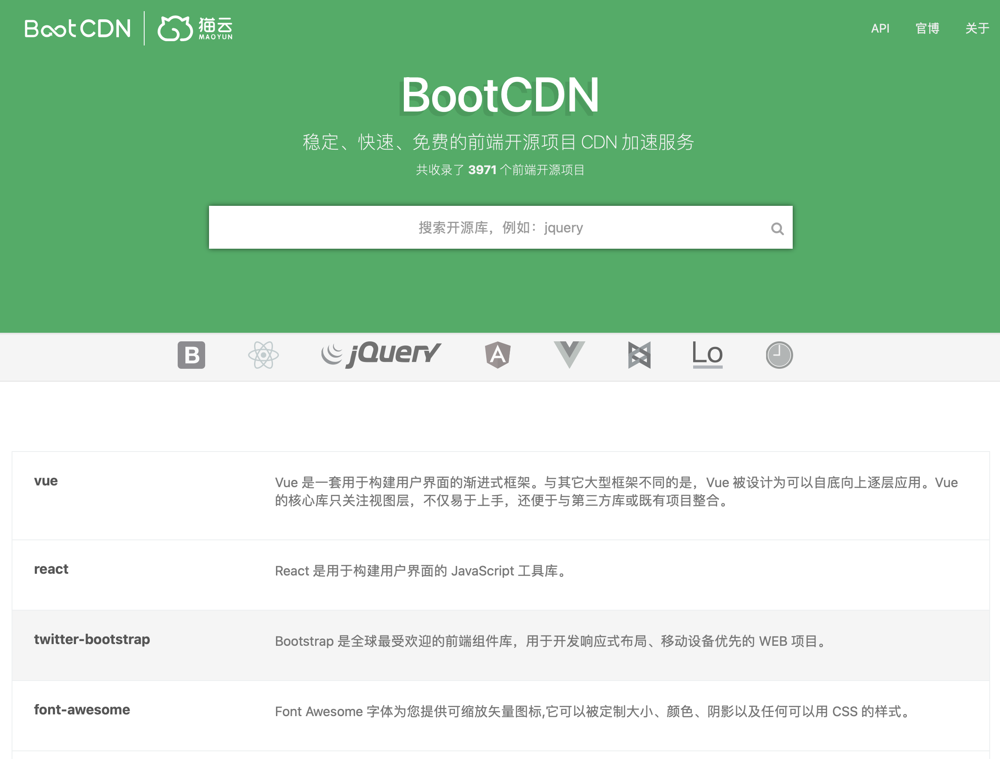
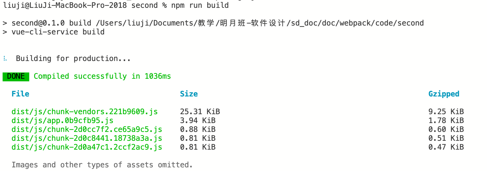

- [什么是webpack](#什么是webpack)
- [优化vue打包](#优化vue打包)
# 什么是webpack
webpack是一个前端资源加载/打包工具。明月班的同学如果不做产品的最终发布，可以先忽略这部分知识。webpack的详细参考见[菜鸟webpack入门教程](https://www.runoob.com/w3cnote/webpack-tutorial.html)。vue使用webpack进行打包，因此如果要优化vue打包，就需要对webpack进行配置。

# 优化vue打包
vue项目开发完成之后，需要执行`npm run build`进行打包，打包后生成的文件放在`dist`目录下。将`dist`目录下的文件拷贝到服务器，就可以完成网站的发布。对于[vue文档](../vue/vue.md)中的`second`项目，打包的情况如下：



可以看到打包出来的有些文件特别的大，甚至超过了1MB。用户用浏览器访问时，延迟就比较明显。为什么会出现这种情况呢？因为`second`这个项目使用了`echarts`、`iview`和`vue-router`等库，这些库都要进行打包，导致打包后的文件过大。

解决的方法是修改webpack，不对`echarts`、`iview`和`vue-router`打包，而使用[CDN(Content Delivery NetworkContent Delivery Network)](https://baike.baidu.com/item/CDN/420951?fr=aladdin)来引用`echarts`、`iview`和`vue-router`。

首先修改`vue.config.js`加入webpack的配置：
```json
module.exports = {
    configureWebpack: {
        externals: {
            "vue": "Vue",
            "vue-router": "VueRouter",
            "view-design": "iview",
            "iview": "ViewUI",
            "echarts":"echarts",
        }
    }
}
```
`externals`表示哪些库不进行打包。`externals`的格式是：
```json
externals: {
    [JavaScript库名]:[Vue项目中引用该库的名称]
}
```

具体关系见下图



之后修改`public/index.html`，通过CDN引入`echarts`、`iview`和`vue-router`



这些CDN链接是从[bootCDN](https://www.bootcdn.cn)上查找的。实际部署时，也可以先把资源下载下来，放到自己的服务器上。



做完这些优化之后，再运行`npm run build`打包，结果如下：



优化之后，就没有大文件了。优化后的程序代码放在[这里](code/second)。

