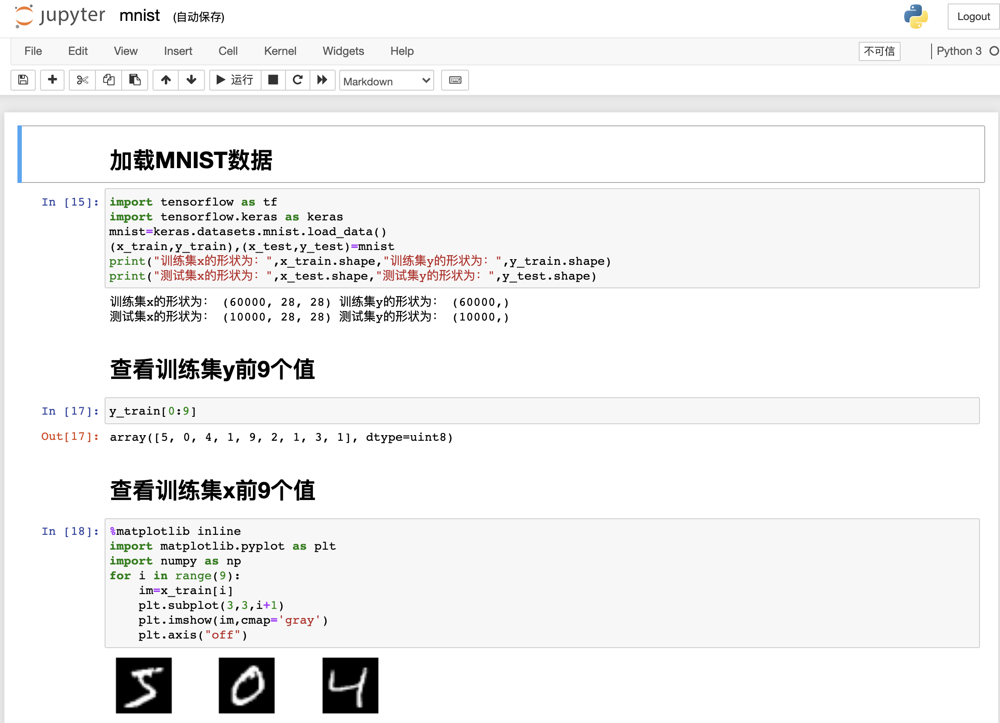
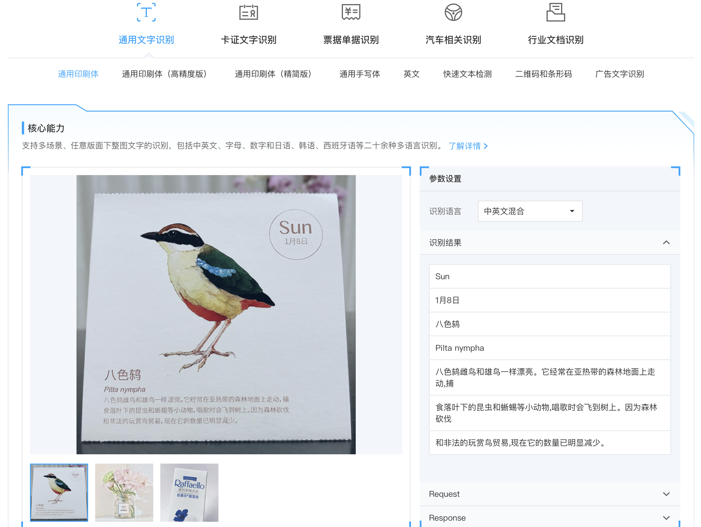
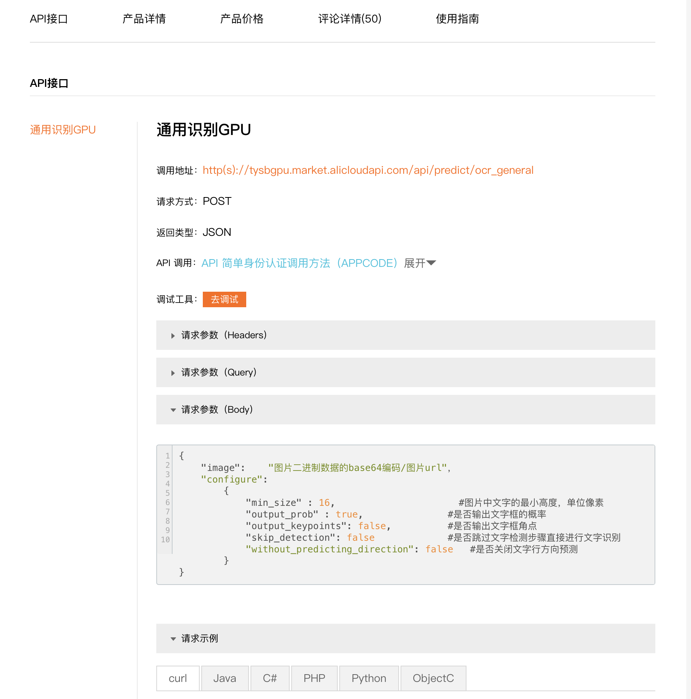

# 任务要求

1. 实现手写字体识别
   - 用深度学习训练（采用此技术路线需要学习深度学习）
   - 或用云服务（采用此技术路线需要学习如何使用云服务）
2. 编写GUI用户界面
   - 用户在界面上书写文字
   - 或用户提交带手写字体的图片
3. 将识别的文字显示在GUI界面上

# 参考资料

## MNIST手写数字识别

执行以下指令运行`liujiboy/mnist`镜像

```shell
docker run -d -p 8888:8888 liujiboy/mnist
```

执行后用浏览器访问`http://localhost:8888`，输入密码`123`，再打开`mnist.ipynb`，查看用深度学习方法实现MNIST手写数字识别的教程。



## 腾讯云手写字体识别

腾讯云提供文字识别OCR的云服务（https://cloud.tencent.com/product/generalocr）。利用云服务可以省去训练模型的麻烦，但需要学习云服务的使用，且使用量较大时需要付费（用量小免费）。



# 阿里云手写字体识别

阿里云提供文字识别ORC的云服务（https://ai.aliyun.com/ocr/general?spm=5176.19720258.J_8058803260.262.47cb2c4awbkbOU）。



# Python GUI库

Python有多个GUI库可以采用，常见的有：

1. Tkinter：https://www.runoob.com/python/python-gui-tkinter.html
2. wxPython：https://www.jianshu.com/p/33081a77b2c8
3. PyQt：https://zhuanlan.zhihu.com/xdbcb8
4. PyGame：https://www.pygame.org/

# 其他GUI选择

可以选择网页、微信小程序或者手机App作为GUI前端，后端用Flask等技术调用手写字体识别程序。

前端技术：

1. vue：https://www.runoob.com/vue2/vue-tutorial.html
2. 微信小程序：https://developers.weixin.qq.com/miniprogram/dev/framework/quickstart/

后端技术：

1. flask：https://dormousehole.readthedocs.io/en/latest/
2. php：https://www.runoob.com/php/php-tutorial.html

