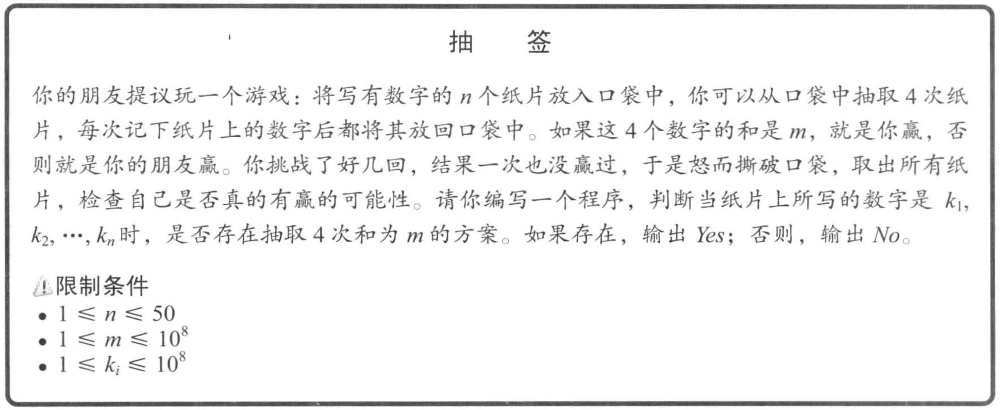
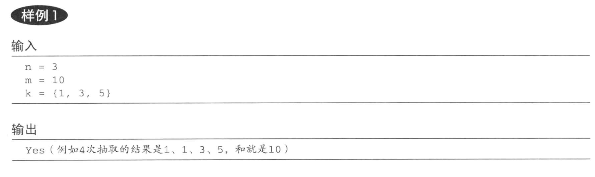
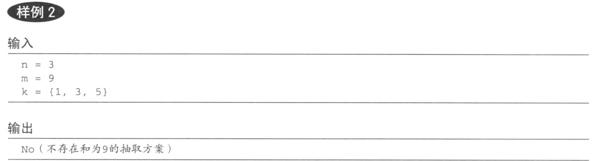
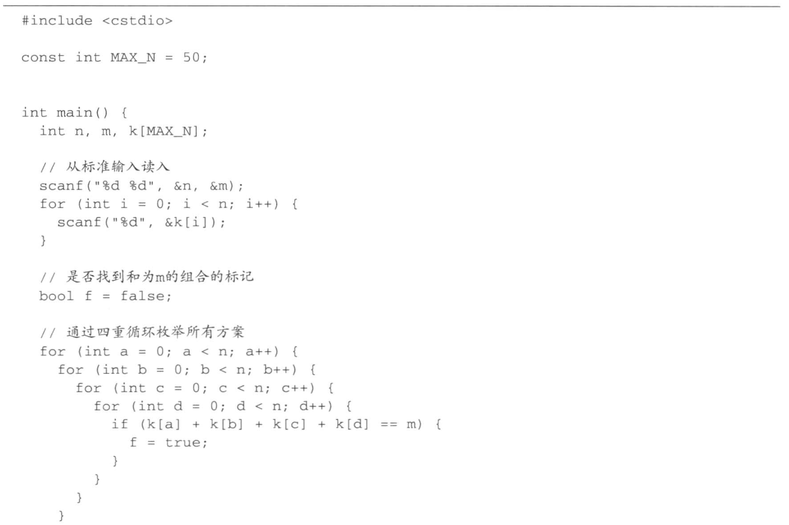
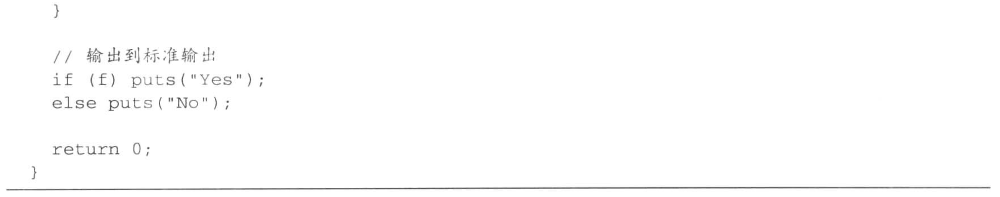
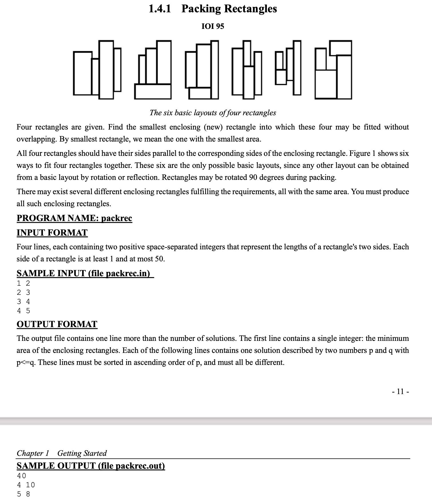
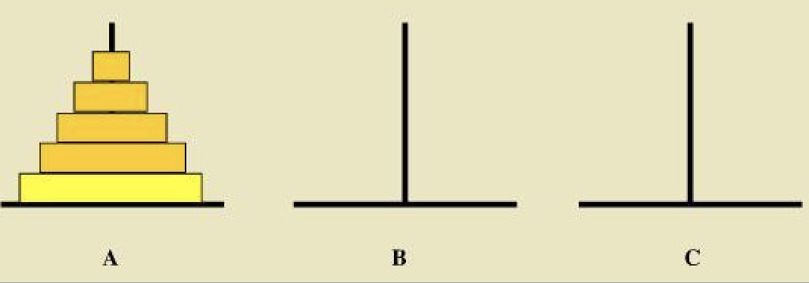

- [学习目标](#学习目标)
- [学习方法](#学习方法)
- [什么是算法和数据结构](#什么是算法和数据结构)
- [算法的复杂度](#算法的复杂度)
- [P、NP、NPC和NPH问题](#pnpnpc和nph问题)
- [编程需要解决的两个问题](#编程需要解决的两个问题)
- [常用数据结构](#常用数据结构)
  - [数组](#数组)
  - [顺序表（vector）](#顺序表vector)
  - [链表（list）](#链表list)
  - [栈（stack）](#栈stack)
  - [队列](#队列)
  - [Hash表](#hash表)
- [常用算法](#常用算法)
  - [穷举法](#穷举法)
  - [递归](#递归)
  - [排序](#排序)
  - [查找](#查找)

# 学习目标

1. 掌握初级、中级算法和数据结构

2. 了解高级算法和数据结构
3. 建立计算思维

# 学习方法

1. 课堂：讲解知识点
2. 课后：通过Online Judge系统（[pintia.cn](pintia.cn)）在线做题（USACO练习题）
3. 课后：结合USACO练习的题解，自己查资料，深入学习算法和数据结构

# 什么是算法和数据结构

<font style="font-size:2rem;">**程序=算法+数据结构**</font>

<font style="font-size:2rem">**软件=很多程序+文档**</font>

**算法：**指解题方案的准确而完整的描述，是一系列解决问题的清晰指令，算法代表着用系统的方法描述解决问题的策略机制。

**数据结构：**计算机算法存储、组织数据的方式。

**编程语言：**实现算法和数据结构的工具

举个例子







**程序代码**





**算法**

```
读取n和m
循环n次，读取数据存储在数组k中，k[i]对应第i个读取的数据
f=false
for a=0 to n
	for b=0 to n
		for c=0 to n
			for d=0 to n
				如果 k[a]+k[b]+k[c]+k[d]==m 那么 f=true
如果f==true 输出 Yes
反之，输出No
```

**数据结构**

$n、m和k$是上述算法用到的数据结构——简单数据结构，即普通变量和数组。

**算法用其他语言实现**

```python
MAX_N=50
k=[0 for i in range(MAX_N)] #50个0的数组
n=int(input())
m=int(input())
for i in range(n):
    k[i]=int(input())
f=False
for a in range(n):
    for b in range(n):
        for c in range(n):
            for d in range(n):
                if k[a]+k[b]+k[c]+k[d]==m:
                    f=True
if f:
    print("Yes")
else:
    print("No")
```

# 算法的复杂度

**时间复杂度**：算法执行所需要消耗的时间

**空间复杂度**：算法执行所需要消耗的空间

算法的时间复杂度和空间复杂度用符号$O(\cdot)$来表示，例如$O(c)$、$O(n)$、$O(n^2)$等，$n$表示问题的规模（或者输入的数据量）。

上述算法的时间复杂度为$O(n^4)$，空间复杂度为$O(c)$。

若$n \le 50$，则最大需要$O(50^4)$的计算时间。

若$n \le 1000$，则最大需要$O(1000^4)$的计算时间。

以时间复杂度为例，不同时间复杂度的算法在$n$增加时，时间增加的幅度是不同的。

假设1次运算需要1ms，那么不同时间复杂度在不同$n$情况下所需要的时间消耗如下：

| 时间复杂度 | n    | 消耗时间（ms） | n    | 消耗时间（ms）                           |
| ---------- | ---- | -------------- | ---- | ---------------------------------------- |
| $O(c)$     | 10   | c              | 1000 | c                                        |
| $O(n)$     | 10   | 10             | 1000 | 1000                                     |
| $O(n^2)$   | 10   | 100            | 1000 | 1000000                                  |
| $O(n^4)$   | 10   | 10000          | 1000 | $1000000000000 \approx 31.7年$           |
| $O(2^n)$   | 10   | $2^{10}=1024$  | 1000 | $2^{1000}\approx3.3977\times 10^{290}年$ |
| $O(n!)$    | 10   | 3628800        | 1000 | $1000!=4.02387\times 10^{2567}$          |

**空间复杂度有类似的性质。**

# P、NP、NPC和NPH问题

**P问题：**所有可以由一个[确定型图灵机](https://baike.baidu.com/item/确定型图灵机)在[多项式时间](https://baike.baidu.com/item/多项式时间)内解决的问题。

**NP问题：**所有可以在多项式时间内验证它的解是否正确的决定问题组成，或者等效的说，那些可以在[非确定型图灵机](https://baike.baidu.com/item/非确定型图灵机)上在[多项式时间](https://baike.baidu.com/item/多项式时间)内找出解的问题。

简单说，P问题是NP问题的子集，但$P=NP$有待证明（学术界倾向于$P\ne NP$）。

**NPC问题（NP Complete）：**如果对该类中的某一个问题设计出多项式时间复杂性的算法，那么该类中的每一个问题也都存在多项式时间复杂性的算法；反之,如果证明了该类中的某一个问题不存在多项式时间的算法，那么该类中的所有问题也不可能存在多项式时间复杂性的算法。

**NPH问题（NP Hard）：**若问题A不属于NP类，已知某一NPC问题可在多项式时间内转化为问题A，则称A为NPH（旅行推销员问题是著名的HPH问题）。

问题的**计算难度**：**$NPH \ge NPC \ge NP \ge P$**

所谓**计算难度**是指解决此问题的算法的时间复杂度，并不是**设计算法的难度**。NP问题具有显而易见的解决方法——穷举，但在有限的时间内**穷举**，并不可行。

**访问宇宙中所有星球的方法是显而易见的，但即使有超光速，也不可行。**


# 编程需要解决的两个问题

1. 设计正确且高效的算法

   - 设计低时间复杂度的算法

   - NP问题，则考虑近似算法，存储空间换计算时间或者剪枝

   - 数据结构的选择对算法效率的影响极大

2. 正确的实现算法

   - 掌握编程语言
   - 掌握编程工具
   - 调用正确的算法库

**编程的主要困难是设计算法，而不是实现算法。**


# 常用数据结构

简言之，数据结构是一组数据在计算机中的存储方式，以及这组数据的操作算法。这种存储方式保证在进行某类操作时，具有较高的性能。所谓数据的操作，主要指插入、删除、读取（修改）。常见的数据结构及其操作的时间复杂度（最坏情况）如下：

| 名称   | 长度动态扩展 | 插入元素   | 删除元素                             | 读取（修改）元素 | Python   | C++       |
| ------ | ------------ | ---------- | ------------------------------------ | ---------------- | -------- | --------- |
| 数组   | 否           | $O(n)$     | $O(c)$的查找时间$O(n)$的移动元素时间 | $O(c)$           | a=[0]*10 | int a[10] |
| 顺序表 | 是           | $O(n)$     | $O(c)$的查找时间$O(n)$的移动元素时间 | $O(c)$           | list     | vector    |
| 链表   | 是           | $O(n)$     | $O(n)$的查找时间$O(c)$的移动元素时间 | $O(n)$           | 无       | list      |
| 栈     | 是           | $O(c)$     | $O(c)$                               | 栈顶元素$O(c)$   | 无       | stack     |
| 队列   | 是           | 队尾$O(c)$ | 队首$O(c)$                           | 队首$O(c)$       | 无       | queue     |
| Hash表 | 是           | $O(c)$     | $O(c)$                               | $O(c)$           | 字典{}   | map       |


## 数组

**静态数组**

```c++
int a[10];
a[5]=5; //插入数据
cout<<a[5]<<endl; //读取数据
```

**动态数组**

```c++
int* a=new int[10];
double* b=new double[50];
a[5]=5; //插入数据
cout<<a[5]<<endl; //读取数据
```

## 顺序表（vector）

参考http://www.cplusplus.com/reference/vector/vector/

```c++
#include <iostream>
#include <vector>
using namespace std;
int main ()
{
  vector<int> myvector;
  myvector.push_back(1);
  myvector.push_back(2);
  myvector.push_back(3);
  for(auto v:myvector)
  { 
      cout<<v<<endl;
  } 
  return 0;
} 
```

## 链表（list）

参考http://www.cplusplus.com/reference/list/list/

```c++
#include <iostream>
#include <list>
using namespace std;
int main ()
{
  list<int> mylist;
  mylist.push_back(1);
  mylist.push_back(2);
  mylist.push_back(3);
  for(auto v:mylist)
  { 
      cout<<v<<endl;
  } 
  return 0;
} 
```

## 栈（stack）

参考http://www.cplusplus.com/reference/stack/stack/

```c++
#include <iostream>       // std::cout
#include <stack>          // std::stack

int main ()
{
  std::stack<int> mystack;

  for (int i=0; i<5; ++i) mystack.push(i);

  std::cout << "Popping out elements...";
  while (!mystack.empty())
  {
     std::cout << ' ' << mystack.top();
     mystack.pop();
  }
  std::cout << '\n';

  return 0;
}
```

## 队列

参考http://www.cplusplus.com/reference/queue/queue/

http://www.cplusplus.com/reference/deque/deque/

http://www.cplusplus.com/reference/queue/priority_queue/

```c++
#include <iostream>       // std::cin, std::cout
#include <queue>          // std::queue

int main ()
{
  std::queue<int> myqueue;
  myqueue.push_back (100);
  myqueue.push_back (200);
  myqueue.push_back (300);

  std::cout << "myqueue contains: ";
  while (!myqueue.empty())
  {
    std::cout << ' ' << myqueue.front();
    myqueue.pop();
  }
  std::cout << '\n';

  return 0;
}
```


```c++
#include <iostream>
#include <deque>

int main ()
{
  std::deque<int> mydeque;

  mydeque.push_back (100);
  mydeque.push_back (200);
  mydeque.push_back (300);

  std::cout << "Popping out the elements in mydeque:";
  while (!mydeque.empty())
  {
    std::cout << ' ' << mydeque.front();
    mydeque.pop_front();
  }

  std::cout << "\nThe final size of mydeque is " << int(mydeque.size()) << '\n';

  return 0;
}
```


```c++
// priority_queue::push/pop
#include <iostream>       // std::cout
#include <queue>          // std::priority_queue

int main ()
{
  std::priority_queue<int> mypq;

  mypq.push(30);
  mypq.push(100);
  mypq.push(25);
  mypq.push(40);

  std::cout << "Popping out elements...";
  while (!mypq.empty())
  {
     std::cout << ' ' << mypq.top();
     mypq.pop();
  }
  std::cout << '\n';

  return 0;
}
```


## Hash表

参考http://www.cplusplus.com/reference/map/map/

```c++
#include <iostream>
#include <map>
#include <string>

int main ()
{
  std::map<char,std::string> mymap;

  mymap['a']="an element";
  mymap['b']="another element";
  mymap['c']=mymap['b'];

  std::cout << "mymap['a'] is " << mymap['a'] << '\n';
  std::cout << "mymap['b'] is " << mymap['b'] << '\n';
  std::cout << "mymap['c'] is " << mymap['c'] << '\n';
  std::cout << "mymap['d'] is " << mymap['d'] << '\n';

  std::cout << "mymap now contains " << mymap.size() << " elements.\n";

  return 0;
}
```

# 常用算法

## 穷举法

凡是能够找到算法的问题，均存在一个穷举算法。因为**一个问题是否存在算法，是根据问题是否可穷举来判定的**。

此问题不存在算法：**0之后的第一个实数**（存在但无法计算，因为不可穷举）

抽签问题可以用穷举法解决，时间复杂度是$O(n^4)$。当$n$不太大时，穷举能够在较短的时间内计算出结果。


某些问题有且只有穷举法，比如**访问宇宙中的所有星球，或者数一数天上有多少星星**。

**事实上，掌握穷举法就能打败90%的程序员**，因为很多问题，要想出一种覆盖全部情况的穷举，也是非常困难的。例如[四色问题的证明](https://www.zhihu.com/question/21406386)（穷举满足某数学条件的各种情况）、停车场计费算法（分段计费、分时计费、特殊车辆计费、节假日计费、积分折扣、包月、包路段）和双十一打折算法（穷举各种满几百省几十、红包、定金折扣、马爸爸清空购物车等）。

**程序设计的初学者，应该把训练重点放在穷举法上**。

下面是一道著名的穷举难题



## 递归

**汉诺塔问题**

将$A$柱上的圆盘经过$B$柱移动到$C$柱上，要求小圆盘只能放在大圆盘上。



```python
def move(n,a,b,c):
  if n==1:
    print(a,'--->',c)
  else:
    move(n-1,a,c,b)
    move(1,a,b,c)
    move(n-1,b,a,c)
move(5,'A','B','C')
```

移动过程

```
A ---> C
A ---> B
C ---> B
A ---> C
B ---> A
B ---> C
A ---> C
A ---> B
C ---> B
C ---> A
B ---> A
C ---> B
A ---> C
A ---> B
C ---> B
A ---> C
B ---> A
B ---> C
A ---> C
B ---> A
C ---> B
C ---> A
B ---> A
B ---> C
A ---> C
A ---> B
C ---> B
A ---> C
B ---> A
B ---> C
A ---> C
```

```c++
#include<iostream>
using namespace std;
void move(int n,char a,char b,char c){
  if(n==1){
    cout<<a<<"--->"<<c<<endl;
  }
  else
  {
    move(n-1,a,c,b);
    move(1,a,b,c);
    move(n-1,b,a,c);
  }
}
int main()
{
  move(5,'A','B','C');
  return 0;
}
```

**汉诺塔的时间复杂度是：**$O(2^n)$

## 排序

python用`sorted`函数，C++用`sort`函数。

```python
a=[1,2,5,4]
a=sorted(a)
print(a)
```
进一步参考：https://www.runoob.com/python3/python3-func-sorted.html


```c++
#include<iostream>
#include<vector>
#include<algorithm>
using namespace std;
int main(){
  int a[]={1,2,5,4};
  vector<int> b;
  b.push_back(1);
  b.push_back(2);
  b.push_back(5);
  b.push_back(4);
  sort(a,a+4); //对数组a排序
  sort(b.begin(),b.end()); //对vector b进行排序
  cout<<"排序后a的值为："<<endl;
  for(int i:a)
  {
    cout<<i<<endl;
  }
  cout<<"排序后b的值为："<<endl;
  for(int i:b)
  {
    cout<<i<<endl;
  }
}
```

进一步的参考：http://www.cplusplus.com/reference/algorithm/sort/

更复杂的例子

```c++
#include<iostream>
#include<vector>
#include<string>
#include<algorithm>
using namespace std;
struct Student{
        string name;
        int score;
};
bool operator<(const Student&s1,const Student&s2)
{
        return s1.score<s2.score;
}
bool cmp(const Student&s1,const Student&s2)
{
        return s1.score>s2.score;
}
int main(){
        vector<Student> v;
        Student s1={"张三",10};
        Student s2={"李四",5};
        Student s3={"王五",3};
        Student s4={"赵六",20};
        v.push_back(s1);
        v.push_back(s2);
        v.push_back(s3);
        v.push_back(s4);
        sort(v.begin(),v.end());
        cout<<"升序排列"<<endl;
        for(Student i:v)
        {   
                cout<<i.name<<" "<<i.score<<endl;
        }   
        sort(v.begin(),v.end(),cmp);
        cout<<"降序排列"<<endl;
        for(Student i:v)
        {   
                cout<<i.name<<" "<<i.score<<endl;
        }   
}
```

## 查找

普通查找的时间复杂度为$O(n)$，参考http://www.cplusplus.com/reference/algorithm/find/

```c++
#include <iostream>     // std::cout
#include <algorithm>    // std::find
#include <vector>       // std::vector
int main () {
  // using std::find with array and pointer:
  int myints[] = { 10, 20, 30, 40 };
  int * p;

  p = std::find (myints, myints+4, 30);
  if (p != myints+4)
    std::cout << "Element found in myints: " << *p << '\n';
  else
    std::cout << "Element not found in myints\n";

  // using std::find with vector and iterator:
  std::vector<int> myvector (myints,myints+4);
  std::vector<int>::iterator it;

  it = find (myvector.begin(), myvector.end(), 30);
  if (it != myvector.end())
    std::cout << "Element found in myvector: " << *it << '\n';
  else
    std::cout << "Element not found in myvector\n";

  return 0;
}
```

对排序数据，可以采取二分查找，时间复杂度为$O(log_2n)$，参考http://www.cplusplus.com/reference/algorithm/binary_search/

```c++
#include <iostream>     // std::cout
#include <algorithm>    // std::binary_search, std::sort
#include <vector>       // std::vector

bool myfunction (int i,int j) { return (i<j); }

int main () {
  int myints[] = {1,2,3,4,5,4,3,2,1};
  std::vector<int> v(myints,myints+9);                         // 1 2 3 4 5 4 3 2 1

  // using default comparison:
  std::sort (v.begin(), v.end());

  std::cout << "looking for a 3... ";
  if (std::binary_search (v.begin(), v.end(), 3))
    std::cout << "found!\n"; else std::cout << "not found.\n";

  // using myfunction as comp:
  std::sort (v.begin(), v.end(), myfunction);

  std::cout << "looking for a 6... ";
  if (std::binary_search (v.begin(), v.end(), 6, myfunction))
    std::cout << "found!\n"; else std::cout << "not found.\n";
  return 0;
}
```

